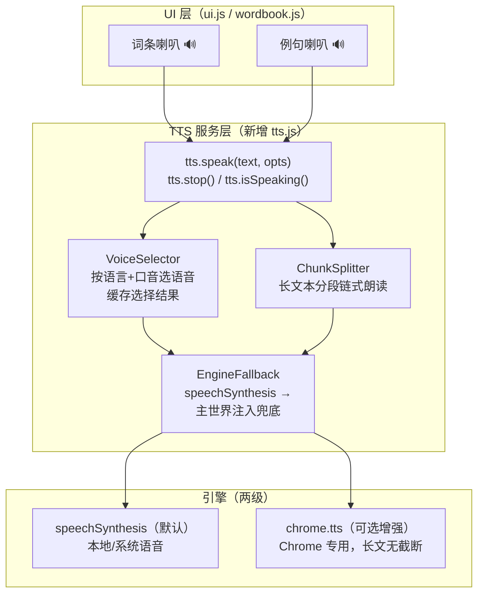

# 卡片读音（TTS）功能可行性方案

## —— 为词条 / 例句增加「浏览器读音」，点击即读

> 需求：学习卡片中的英文部分（词条、源语例句）支持点击喇叭图标，用浏览器内置读音直接朗读。
> 本文档：技术路线调研 → 可行性结论 → 详细设计 → 已知坑规避 → 实施计划。


***

## 目录


1. [需求分析](#1-需求分析)

2. [技术方案调研](#2-技术方案调研)

3. [可行性结论](#3-可行性结论)

4. [推荐方案架构](#4-推荐方案架构)

5. [详细设计](#5-详细设计)

6. [关键坑与规避（实测经验）](#6-关键坑与规避实测经验)

7. [兼容性矩阵](#7-兼容性矩阵)

8. [可选增强：在线 TTS 提供商](#8-可选增强在线-tts-提供商)

9. [UI 集成点与交互设计](#9-ui-集成点与交互设计)

10. [实施步骤与工作量](#10-实施步骤与工作量)

11. [风险与结论](#11-风险与结论)


***

## 1. 需求分析

### 1.1 用户需求

> "卡片的英文部分，例如词语、句子，都应该增加浏览器读音功能，直接点击播放，浏览器读音读出来。"

拆解为明确的验收标准：


| 需求点  | 说明                                                                  |
| ---- | ------------------------------------------------------------------- |
| 词条读音 | 点击词条旁喇叭，朗读 `term`（如 `insight`）                                      |
| 例句读音 | 点击例句旁喇叭，朗读**该例句的源语言行**（第一行，如 `This insight changed my view.`），不读翻译行 |
| 触发方式 | 点击播放（用户手势，天然满足浏览器 autoplay 政策）                                      |
| 发音来源 | **浏览器内置读音**（无需网络、无需 API Key、无需额外服务）                                 |
| 覆盖场景 | 浮层学习视图、卡片编辑视图、单词本详情的卡片                                              |

### 1.2 隐含需求


* **语言正确**：朗读需匹配源语言（英文→英音 / 美音，日文→日语语音……）；

* **英音 / 美音可配置**：沿用现有 `accent` 设置（us/uk）；

* **打断与切换**：切换卡片 / 点击其他喇叭时应停止正在朗读的音频；

* **长例句不截断**：Chrome 对单次朗读有约 15 秒上限，需分段；

* **失败优雅降级**：系统无对应语音时回退默认语音或给出提示。


***

## 2. 技术方案调研

### 2.1 候选路线对比


| 维度         | 路线 A：Web Speech API（`speechSynthesis`） | 路线 B：`chrome.tts`（扩展专属 API）           | 路线 C：在线 TTS API（Edge/Azure/ElevenLabs） |
| ---------- | -------------------------------------- | ------------------------------------- | -------------------------------------- |
| **性质**     | 浏览器原生 Web API                          | Chrome 扩展专用 API                       | 云端付费服务                                 |
| **成本**     | 免费、零依赖                                 | 免费                                    | 需 API Key，多数按字符计费                      |
| **网络依赖**   | 无（本地语音引擎）                              | 无（系统 TTS 引擎）                          | 需要网络                                   |
| **权限**     | 无                                      | 需 `tts` 权限                            | 需 `host_permissions` + Key             |
| **浏览器覆盖**  | Chrome / Edge / Firefox / Safari 全支持   | **仅 Chrome**（Edge 兼容性存疑）              | 不限浏览器                                  |
| **单次长度限制** | 约 **15 秒 / 200–250 字符**截断（需分段）         | 最大 **32768 字符**（无 15s 限制）             | 通常按字符上限，很宽松                            |
| **音质**     | 取决于操作系统语音库（一般）                         | 取决于系统 TTS 引擎（一般）                      | 最好（神经网络音色）                             |
| **可在哪调用**  | 页面 /content script                     | **background service worker**（MV3 支持） | background fetch                       |
| **语音选择**   | `getVoices()` 按 lang 筛选                | `getVoices()` / `voiceName` 指定        | 指定 voice 模型 ID                         |
| **适合本需求**  | ✅ 主方案                                  | ⚠️ Chrome 增强（可选）                      | 🔶 高级可选项                               |

### 2.2 关键技术事实（已检索核实）


1. **Chrome 15 秒截断**：Chrome 对单个 `SpeechSynthesisUtterance` 约 15 秒（约 200–250 字符）后静默截断，且不触发 `end`/`error` 事件 —— 必须按句分段 + 链式朗读（业界通用做法）。

2. `getVoices()`**&#x20;首次返回空**：Chrome 中语音列表异步加载，首次调用返回空数组，需监听 `voiceschanged` 事件（+ 轮询兜底）。

3. **需要用户手势**：Chrome M71 起 `speak()` 需先有用户交互 —— 本需求是 "点击播放"，天然满足。

4. **引擎挂起问题**：Chrome 偶发 "第一次 speak 后引擎不发声"，业界修复是 `speak()` 后紧跟一次 `resume()` 唤醒（nudge 技巧）。

5. **远程语音不稳**：Chrome 的 Google 云端语音（`Google US English` 等）历史上可靠性差于本地语音，实现时应优先本地语音。

6. `chrome.tts`**&#x20;无 15s 限制**：官方文档确认最大 32768 字符，且在扩展后台可用 —— 可作为长文朗读的 Chrome 增强通道。

7. **content script 环境**：`speechSynthesis` 在扩展 content script 中可访问；若个别 Chrome 版本出现无声，可降级为注入主世界脚本调用（复用现有 `page_inject.js` 的 postMessage 通道）—— 本方案已内置该兜底。


***

## 3. 可行性结论

> **✅ 高度可行，成本趋近于零，无需后端、无需 API Key，立即可落地。**


* 用户要的 "浏览器读音" 正是 **Web Speech API** 的定位：零成本、全平台、无网络依赖；

* 项目已具备良好集成条件：卡片数据结构现成、浮层 / 单词本 UI 现成、`page_inject.js` 主世界通信通道现成；

* 所有已知坑（15s 截断、空语音列表、引擎挂起、手势要求）均有成熟规避方案，风险可控；

* **唯一注意点**：朗读音质取决于操作系统自带语音库（Windows 用 Edge/SAPI 语音、macOS 用系统语音），对学习用途完全够用；追求更自然音质可后续接在线 TTS（§8，可选）。


***

## 4. 推荐方案架构




**分层原则**：


* **UI 层只发 "读什么"**（词条 / 例句第一行），不关心引擎细节；

* **tts.js 统一封装**：语音选择、分段、事件、状态、降级全收口在一处；

* **引擎可插拔**：默认 `speechSynthesis`，未来可无缝切换到 `chrome.tts` 或在线 TTS。


***

## 5. 详细设计

## 5.1 tts 模块接口（新增 `assets/tts.js`，供 ui.js 与 wordbook.js 共用）


```
// 读指定文本（自动按语言选语音、长文分段、返回 Promise）

tts.speak(text, opts) => Promise\<void>

//   opts: { lang?: 'en'|'ja'|'zh\_CN'|..., accent?: 'us'|'uk', rate?: number(默认0.9),

//           onStart?, onEnd?, onError? }

// 立即停止（切换卡片/再点击时调用）

tts.stop()

// 当前是否正在朗读（用于喇叭图标状态切换）

tts.isSpeaking() => boolean

// 预加载语音列表（Promise 化，解决 getVoices 异步）

tts.loadVoices() => Promise\<Voice\[]>

// 为某语言选最佳语音（内部：VoiceSelector）

tts.pickVoice(lang, accent) => Voice|null
```

## 5.2 语音选择策略（VoiceSelector）

按 `normalizeLang` 归一化后的语言 + `accent` 设置选择：


| 源语言            | 首选语音（lang 前缀 + 口音）  | 回退      |
| -------------- | ------------------- | ------- |
| en + accent=us | `en-US`             | `en` 任意 |
| en + accent=uk | `en-GB`             | `en` 任意 |
| ja             | `ja-JP`             | `ja`    |
| ko             | `ko-KR`             | `ko`    |
| zh\_CN         | `zh-CN`（普通话）        | `zh`    |
| zh\_TW         | `zh-TW` / `zh-Hant` | `zh`    |
| ru             | `ru-RU`             | `ru`    |
| fr / de / es   | 对应语言前缀              | 该语言任意   |
| 其它 / 未知        | 默认语音                | —       |

**实现要点**：


* 先 `loadVoices()` 拿全量列表，按 `voice.lang` 前缀精确匹配；同语言多个语音时**优先本地（localService=true）**、名字含 "Natural/Neural/Online" 优先；

* 选中的 `voice.name` 缓存到 `chrome.storage.local`（键 `cc_tts_voice_pref:{lang}`），下次直接复用，避免重复选择不稳定语音；

* 无匹配语音时回退浏览器默认语音，并在第一次使用时静默降级（不打扰用户）。

## 5.3 长文本分段朗读（ChunkSplitter）

**问题**：Chrome 单次 `speak()` 约 15 秒即截断（约 200–250 字符），且不触发结束事件。

**方案**：按句边界切块（≤ \~180 字符 / 块），逐块 `speak()`，用 `onend` 链式播下一块；全部播完才 resolve：


```
function speakLong(text, voice, opts) {

&#x20; const chunks = splitBySentence(text, 180); // 句边界切分

&#x20; return new Promise((resolve, reject) => {

&#x20;   let i = 0;

&#x20;   const playNext = () => {

&#x20;     if (i >= chunks.length) return resolve();

&#x20;     const u = new SpeechSynthesisUtterance(chunks\[i++]);

&#x20;     u.voice = voice; u.rate = opts.rate || 0.9; u.lang = voice.lang;

&#x20;     u.onend = playNext;

&#x20;     u.onerror = (e) => { if (e.error !== 'interrupted') reject(e); };

&#x20;     synth.speak(u);

&#x20;     // nudge：唤醒引擎，防挂起

&#x20;     setTimeout(() => { if (synth.paused) synth.resume(); }, 10);

&#x20;   };

&#x20;   playNext();

&#x20; });

}
```

> 词条通常 1–3 个词，直接单次朗读；仅
>
> **长例句 / 长段落**
>
> 走分段。当前卡片例句最多 2 行、单行通常 < 200 字符，绝大多数场景不会触发分段，但实现上必须防御。

## 5.4 播放状态机与事件处理


```
空闲 ──点击喇叭──▶ 播放中（喇叭高亮/旋转动画）

&#x20;                     │

&#x20;      ┌──────────────┼───────────────────┐

&#x20;      │再次点击(同一)  │切换卡片/读其它     │结束/错误

&#x20;      ▼              ▼                    ▼

&#x20;    停止+回到空闲      tts.stop() → 播新的    回到空闲
```


* **互斥播放**：全局仅一个播放实例；任何新 `speak` 前先 `tts.stop()`；

* **打断清空**：`stop()` 内部调用 `synth.cancel()` + 清空分段队列，避免 `onend` 残留回调继续播后续块；

* **卡片切换联动**：`ui.js` 的 `renderLearnView` / 键盘翻卡时调用 `tts.stop()`；

* **播放状态反馈**：正在朗读的喇叭加 `.playing` class（旋转 / 高亮），`onend/onerror` 后移除。

## 5.5 引擎降级链路（EngineFallback）


1. 默认在 **content script** 直接使用 `window.speechSynthesis`（隔离世界可访问，多数 Chrome/Edge 正常）；

2. 若检测到 `speechSynthesis` 不可用或调用后无声（首次 `getVoices()` 为空且 `voiceschanged` 超时），**降级为主世界注入**：复用 `page_inject.js` 的消息通道，注入一段迷你脚本在主世界执行 `speak()`（该脚本通过 `web_accessible_resources` 暴露，已有成熟机制）；

3. 仍失败 → 提示 "当前浏览器不支持朗读"（`cc_tts_unsupported` i18n 文案）。


***

## 6. 关键坑与规避（实测经验）


| #  | 坑                                  | 表现                   | 规避                                                      |
| -- | ---------------------------------- | -------------------- | ------------------------------------------------------- |
| 1  | **15 秒截断**（Chromium bug 679437）    | 长文本读一半无声，无事件触发       | 按句分段 + `onend` 链式朗读（§5.3）                               |
| 2  | `getVoices()`**&#x20;首次为空**        | 语音列表空，无法选语音          | `voiceschanged` 事件 + 2s 轮询兜底（§5.1 `loadVoices`）         |
| 3  | **autoplay 政策**                    | 非用户手势调用 `speak()` 被拒 | 仅在点击事件内触发（本需求天然满足）                                      |
| 4  | **引擎挂起 / 首音无声**                    | 第一次 speak 不发声        | `speak()` 后 10ms `resume()` nudge；可先播 1 次空 utterance 预热 |
| 5  | **远程语音不可靠**                        | Google 云端语音偶发断       | 优先 `localService=true` 本地语音                             |
| 6  | **切换卡片残留播放**                       | 旧卡片音频继续              | 统一 `tts.stop()`（`cancel()` + 清队列）                       |
| 7  | **语音列表跨页不一致**                      | 刷新后语音顺序 / 可用性变化      | 每次加载时重新 `loadVoices()`，选择结果持久化                          |
| 8  | **content script 个别版本无声**          | 隔离世界调用无声             | 降级主世界注入（§5.5）                                           |
| 9  | `error: 'interrupted'`**&#x20;事件** | 主动打断时触发 error        | 忽略 `interrupted` 错误（视为正常打断）                             |
| 10 | **长例句在单词本 / 浮层重复代码**               | 两处都要加喇叭              | 共享 `tts.js` + 共用渲染函数                                    |


***

## 7. 兼容性矩阵


| 浏览器            | speechSynthesis | chrome.tts                      | 备注                                |
| -------------- | --------------- | ------------------------------- | --------------------------------- |
| Chrome（桌面）     | ✅               | ✅（需 `tts` 权限）                   | 主目标平台                             |
| Microsoft Edge | ✅               | ⚠️ 兼容性存疑（Edge 仅部分支持 `chrome.*`） | 用 speechSynthesis                 |
| Firefox        | ✅               | ❌                               | 用 speechSynthesis                 |
| Safari         | ✅               | ❌                               | 本项目主要面向 Chrome/Edge，Safari 不在首期范围 |

> 结论：以 
>
> `speechSynthesis`
>
>  为默认引擎即可覆盖 Chrome/Edge 双平台（扩展商店两个渠道）；
>
> `chrome.tts`
>
>  仅作为 Chrome 下的可选增强（如长文无截断），默认不开启。


***

## 8. 可选增强：在线 TTS 提供商

若后续追求 "更自然音质"，可仿照现有 LLM 提供商模式（`options` 页配置 + `settingsProfiles`）增加 TTS 提供商：


| 提供商                           | 特点                             | 接入方式              |
| ----------------------------- | ------------------------------ | ----------------- |
| Microsoft Edge TTS            | 免费、音质好（但为逆向接口，扩展内使用有滥用 / 合规风险） | 不推荐在扩展内集成         |
| Azure Speech                  | 自然音色、可定制 voice/rate/pitch      | 官方 REST API + Key |
| Google Cloud TTS / ElevenLabs | 顶级音质                           | REST API + Key    |

**设计原则**：TTS 提供商作为**可插拔引擎**（`tts.js` 内部再加一个 `EngineOnline`），用户未配置时走浏览器内置语音，配置后自动切换为在线音色。**本期不做**，仅预留接口。


***

## 9. UI 集成点与交互设计

### 9.1 集成位置


| 位置         | 文件                                | 改动                                                                            |
| ---------- | --------------------------------- | ----------------------------------------------------------------------------- |
| 浮层大卡片（词条）  | `ui.js` → `renderCardView`        | term 右侧加喇叭 `<button class="cc-speak">`，点击 `tts.speak(c.term, {lang, accent})` |
| 浮层大卡片（例句）  | `ui.js` → `renderExamplesQuoteEx` | 每个例句块第一行右侧加喇叭，朗读 `examples[i]` 第一行                                            |
| 浮层网格视图（可选） | `ui.js` → `renderGrid`            | 网格卡片词条加喇叭                                                                     |
| 单词本详情卡片    | `wordbook.js` → `renderCardView`  | 与浮层一致（共用 `tts.js`）                                                            |
| 设置页        | `options`                         | 增加 "朗读语速"（rate 0.5–1.5）与 "首选引擎"（可选）设置项                                        |

### 9.2 交互细节


* **朗读内容**：词条朗读 `term`；例句只读**源语行**（第一行），不读翻译行 —— 避免中英混读；

* **视觉反馈**：播放中喇叭加 `.cc-playing`（旋转动画或高亮），再次点击停止；

* **朗读文本净化**：朗读前去掉例句中的音标 / 括号注释等杂质（如 `(US: /x/)` 不读）；

* **i18n**：新增 `action_speak`（朗读）、`tts_unsupported`（当前浏览器不支持朗读）等文案；

* **CSS**：`assets/cc.css` 增加 `.cc-speak`、`.cc-playing` 样式（喇叭 SVG 复用现有图标风格）。

### 9.3 数据 / 设置改动


* `DEFAULT_SETTINGS` 增加：`ttsRate: 0.9`、`ttsEngine: 'speech'`（预留 `'chrome'|'online'`）；

* 语音选择偏好存 `cc_tts_voice_pref:{lang}`；

* **现有卡片数据结构与 LLM 管线零改动**（朗读是纯展示层功能）。


***

## 10. 实施步骤与工作量


| 步骤 | 内容                                                          | 涉及文件                                           | 工作量（估）    |
| -- | ----------------------------------------------------------- | ---------------------------------------------- | --------- |
| 1  | 新建 `assets/tts.js`：speak/stop/loadVoices/pickVoice/ 分段 / 降级 | `assets/tts.js`（新增）                            | 0.5–1 天   |
| 2  | 浮层卡片接入喇叭（词条 + 例句 + 状态反馈）                                    | `ui.js`、`assets/cc.css`、`assets/ui.html`(i18n) | 0.5 天     |
| 3  | 单词本详情接入喇叭                                                   | `wordbook.js`、`wordbook.html`                  | 0.5 天     |
| 4  | 设置项（语速 / 引擎）                                                | `options/options.js`、`options/index.html`      | 0.5 天     |
| 5  | 主世界降级通道（如需要）                                                | `page_inject.js` 增加 TTS 消息                     | 0.5 天（兜底） |
| 6  | 多平台手测 + 修复                                                  | 各浏览器                                           | 0.5–1 天   |

**合计约 2.5–4 人日**，可独立于通用化（Phase 1）并行开发。

### 验证用例


1. 英文卡片：点词条喇叭 → 读出该词（美音）；设置切英式 → 读出英音；

2. 例句喇叭 → 只读第一行源语句子，不读翻译行；

3. 长例句（>250 字符）→ 完整读完整句不被截断；

4. 播放中点下一张卡 → 旧朗读立即停止；

5. 同一喇叭连续点击 → 播放 / 停止切换正常；

6. 系统未安装对应语言语音 → 回退默认语音不报错；

7. 刷新页面后再点 → 语音列表正常加载（voiceschanged 生效）。


***

## 11. 风险与结论

### 风险清单


| 风险                      | 等级     | 缓解                 |
| ----------------------- | ------ | ------------------ |
| 音质受操作系统语音库限制            | 低      | 学习用途足够；可选在线 TTS 增强 |
| Chrome 长文本截断            | 低      | 分段链式朗读（业界标准解法）     |
| 个别环境 speechSynthesis 无声 | 低      | 主世界注入降级通道          |
| 多语言语音缺失                 | 低      | 回退默认 + 首次提示        |
| chrome.tts 仅 Chrome     | 中（若依赖） | 不作为默认，仅可选增强        |

### 最终结论


* **可行性：高**。主方案 Web Speech API 完全满足 "浏览器读音、点击即读" 需求，零成本、零后端、零 API Key；

* **改动面小**：新增 1 个 `tts.js` 模块 + 两处渲染函数接入 + 少量样式与设置，核心 LLM 管线与数据结构零改动；

* **可并行**：与 "通用化方案"（文章 / 划词）互不冲突，可先落地此功能快速见效。


***

*本方案关键技术事实（Chrome 15 秒截断、getVoices 异步加载、用户手势要求、chrome.tts 32,768 字符上限等）均经公开资料核实，方案可直接进入实现。*