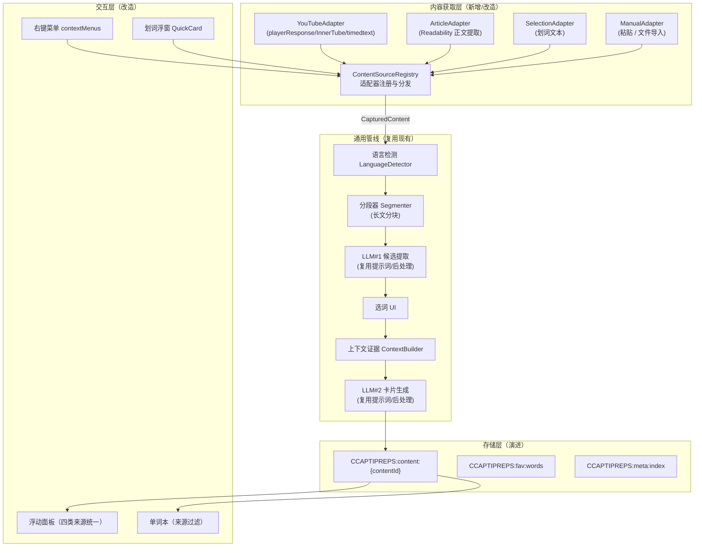

# 捕获生词 通用化解决方案

## —— 从「YouTube 字幕学习」到「任意文章 / 网页 / 划词」的语言学习引擎

> 文档定位：在现有 捕获生词 v1.5.0 代码基础之上，给出把内容来源从 YouTube 扩展到
>
> **通用文章 / 网页 / 划词 / 手动文本**
>
> 的完整技术方案。
> 本文档是
>
> **可落地的设计文档**
>
> ，包含现状诊断、目标架构、模块设计、数据演进、分期实施与风险权衡。


***

## 目录


1. [背景与目标](#1-背景与目标)

2. [现状诊断：强耦合点分析](#2-现状诊断强耦合点分析)

3. [总体方案：内容源适配器架构](#3-总体方案内容源适配器架构)

4. [内容获取层设计（Capture）](#4-内容获取层设计capture)

5. [入口与交互设计](#5-入口与交互设计)

6. [核心管线改造](#6-核心管线改造)

7. [数据与存储演进](#7-数据与存储演进)

8. [Manifest 与权限演进](#8-manifest-与权限演进)

9. [扩展功能（可选增强）](#9-扩展功能可选增强)

10. [分期实施路线图](#10-分期实施路线图)

11. [风险与权衡](#11-风险与权衡)

12. [附录：关键接口与数据结构定义](#12-附录关键接口与数据结构定义)


***

## 1. 背景与目标

### 1.1 现状盘点：什么已经通用，什么还耦合

捕获生词 当前是一个 YouTube 专用扩展，但经过对源码的完整梳理，可以得出一个重要结论：

**✅ 核心价值层已经完全通用（与 YouTube 无关）**


* 两阶段 LLM 管线：LLM#1 从纯文本中提取候选词（输入本来就是 "纯文本字幕"）、LLM#2 生成学习卡片；

* 所有后处理逻辑（证据校验、停用词过滤、脚本门控、POS 本地化、IPA 语言规则、卡片顺序对齐）；

* 三步学习流程状态机 + 断点续跑机制；

* 卡片数据结构、收藏快照、CSV 导出、多语言 i18n。

**❌ 内容获取层 / 元数据层强耦合 YouTube**


* 字幕提取依赖 `playerResponse` / `captionTracks` / InnerTube / `timedtext`；

* 页面信息提取依赖 YouTube DOM 与 URL（`videoId`）；

* 内容标识以 `videoId` 为唯一主键；

* 单词本封面依赖 `i.ytimg.com`；

* manifest 的 content\_scripts 与 web\_accessible\_resources 仅匹配 [youtube.com](https://youtube.com)。

> **核心洞察：通用化的本质，是把 "内容获取层" 抽成可插拔的适配器，而 "管线 / 卡片 / 单词本" 基本可以原样复用。**

### 1.2 通用化目标


| 目标            | 说明                                        |
| ------------- | ----------------------------------------- |
| **文章 / 网页学习** | 任意网页（新闻、博客、维基、文档等）一键剪藏正文 → 走同一学习管线        |
| **划词学习**      | 用户选中任意文本 → 直接作为学习内容源（看到好句随手学）             |
| **手动 / 文件输入** | 粘贴文本、导入 txt/md 文件（进阶：epub）                |
| **内容源并存**     | YouTube / 文章 / 划词 / 手动四类来源统一进入单词本，可区分、可汇总 |
| **向后兼容**      | 已产生的 YouTube 学习数据平滑迁移，不丢失                 |

### 1.3 成功标准（可验收）


1. 在任一非 YouTube 网页上，点击扩展图标能在 ≤3 步内完成 "取文 → 选词 → 制卡"；

2. 长文章（>2 万字）不爆 token，且候选词覆盖度不劣于短文本；

3. 新词库与旧 YouTube 词库共存，单词本能按来源类型过滤；

4. 核心管线（LLM#1 / LLM#2 / 后处理）零改动或最小改动即复用。


***

## 2. 现状诊断：强耦合点分析

逐层列出当前代码对 YouTube 的耦合点，作为改造清单：


| 层    | 文件               | 耦合点                                                            | 耦合强度    | 改造策略                             |
| ---- | ---------------- | -------------------------------------------------------------- | ------- | -------------------------------- |
| 清单   | manifest.json    | content\_scripts /web\_accessible\_resources 仅匹配 YouTube       | 高       | 改为按需注入 + 适配器注册                   |
| 清单   | manifest.json    | host\_permissions 面向 YouTube + LLM                             | 中       | 收窄 LLM + optional 权限             |
| 内容获取 | content.js       | `getYouTubeVideoInfo()` 依赖 YouTube URL/DOM                     | 高       | 抽为「来源描述器」，按适配器实现                 |
| 内容获取 | content.js       | `extractCaptionsText()` 依赖 playerResponse/InnerTube/timedtext  | 高       | 抽为「正文提取器」接口，YouTube 是其一实现        |
| 内容获取 | content.js       | `getSelectedCaptionTrack()` 依赖 YouTube 播放器                     | 中       | 归入 YouTube 适配器内部                 |
| 内容获取 | page\_inject.js  | 完全为 YouTube 定制（ytInitialPlayerResponse / InnerTube /timedtext） | 高       | 保留为 YouTube 适配器的辅助脚本；文章 / 划词无需它  |
| 标识层  | content.js/ui.js | 存储键 `CCAPTIPREPS:video:{videoId}` 以 videoId 为键                 | 高       | 引入通用 `contentId`，保留旧键做迁移         |
| UI   | ui.js            | `startNavWatcher` / 字幕轨切换检测 依赖 YouTube                         | 中       | 抽为「变更检测器」；文章场景改为内容变化检测           |
| UI   | ui.js            | bootFlow/startFlow 的 "视频" 概念                                   | 低       | 术语通用化为 "内容"，逻辑不变                 |
| 单词本  | wordbook.js      | 封面依赖 `i.ytimg.com`                                             | 中       | 封面解析器：视频→ytimg，文章→og:image，其他→占位 |
| 管线   | background.js    | 两阶段 LLM / 后处理 / 提示词                                            | **无耦合** | 原样复用                             |

> 结论：改造面主要集中在 
>
> `content.js`
>
> 、
>
> `ui.js`
>
> 、
>
> `wordbook.js`
>
> 、
>
> `manifest.json`
>
>  四个文件，
>
> `background.js`
>
>  几乎不动。


***

## 3. 总体方案：内容源适配器架构

### 3.1 架构图




### 3.2 核心抽象：统一内容结构 `CapturedContent`

所有适配器的输出统一为一个结构，管线只认识这一个结构：


```
interface CapturedContent {

&#x20; /\*\* 内容唯一 ID：视频→videoId；文章→规范化 URL；划词/手动→正文 hash \*/

&#x20; id: string;

&#x20; /\*\* 来源类型 \*/

&#x20; sourceType: 'youtube' | 'article' | 'selection' | 'manual' | 'file';

&#x20; /\*\* 来源 URL（文章/视频有，划词/手动可无） \*/

&#x20; sourceUrl?: string;

&#x20; /\*\* 标题（视频→视频标题；文章→og:title/readability；划词→首句或"摘录"） \*/

&#x20; title: string;

&#x20; /\*\* 正文纯文本（统一分隔格式，与现字幕文本格式兼容） \*/

&#x20; text: string;

&#x20; /\*\* 语言（ISO 归一化：en/zh\_CN/ja/ko/...）；文章场景由 LanguageDetector 推断 \*/

&#x20; lang?: string;

&#x20; /\*\* 元信息：封面、作者、发布时间等（单词本展示用） \*/

&#x20; meta?: {

&#x20;   coverUrl?: string;

&#x20;   author?: string;

&#x20;   publishedAt?: string;

&#x20;   wordCount?: number;

&#x20; };

&#x20; /\*\* 长文分段后的分段列表（短文本可省略） \*/

&#x20; segments?: ContentSegment\[];

}

interface ContentSegment {

&#x20; index: number;

&#x20; text: string;

&#x20; /\*\* 段落在正文中的字符偏移（用于上下文证据定位） \*/

&#x20; start: number;

&#x20; end: number;

}
```

### 3.3 适配器接口


```
interface ContentSourceAdapter {

&#x20; /\*\* 适配器标识 \*/

&#x20; readonly type: CapturedContent\['sourceType'];

&#x20; /\*\* 判断当前页面是否命中本适配器（注册与分发用） \*/

&#x20; matches(context: PageContext): boolean;

&#x20; /\*\* 提取正文与元信息 \*/

&#x20; capture(context: PageContext): Promise\<CapturedContent>;

&#x20; /\*\* 可选的变更检测（如 YouTube SPA 换视频；文章可检测 body 内容 hash） \*/

&#x20; detectChange?(prev: CapturedContent, now: PageContext): boolean;

}
```

`PageContext` 封装当前页面信息（URL、title、DOM 根节点、选中文本等），由 content.js 统一提供。


***

## 4. 内容获取层设计（Capture）

## 4.1 内容源适配器清单

### 4.1.1 YouTubeAdapter（改造，非重写）


* 保留现有 `page_inject.js` + `extractCaptionsText` + `getYouTubeVideoInfo` 全部逻辑，整体封装进适配器；

* `matches()`：URL 含 `youtube.com/watch|shorts` 或 `youtu.be/`；

* `capture()`：返回现有 `{ text, lang, title }`，补齐 `sourceType:'youtube'` 与 `meta.coverUrl = https://i.ytimg.com/vi/{id}/hqdefault.jpg`；

* `detectChange()`：复用现有 `selectedTrackSig` 逻辑。

### 4.1.2 ArticleAdapter（新增，核心）

**正文提取优先级（逐级回退）**：


```
① 页面 meta 直接提取（快速路径）

&#x20;  og:title / twitter:title / og:description

&#x20;  article:published\_time / article:author

② Readability 类算法提取正文（主路径）

&#x20;  遍历 DOM，按内容密度/标签特征评分，选出主内容节点

&#x20;  剥离：nav / aside / header / footer / script / style / 广告 / 评论

③ 兜底

&#x20;  取 body innerText 截断 + 简单噪声过滤
```

**实现建议**：


* 引入 `@mozilla/readability`（纯 JS、无依赖、成熟）作为正文提取内核，它是 Firefox Reader View 的算法，质量可靠；

* 在 content.js 隔离世界中运行（不需要主世界注入），对大多数静态文章足够；

* 对动态渲染（React/SPA）页面，可等待 `document_idle` + 少量延迟 + 可选的 "重新抓取" 按钮重试。

`capture()`**&#x20;输出**：


* `id = normalizeUrl(location.href)`（去掉 `utm_*`、`fbclid`、`spm` 等跟踪参数 + 稳定化排序）；

* `text = readabilityText`（按段落换行，与现字幕格式 `\n` 兼容）；

* `lang = LanguageDetector.detect(text)`（见 §6.1）；

* `meta.coverUrl = og:image`（优先）→ 无则留空由单词本渲染占位图。

### 4.1.3 SelectionAdapter（新增，划词学习）

**场景**：用户在任意页面选中一段文本，右键 →"用所选内容学习" 或点击划词浮窗。


* 在 content.js 监听 `selectionchange`，出现非空选中时在选区附近渲染小浮窗；

* 浮窗按钮：


  * **加入学习**：`selection = window.getSelection().toString().trim()`，`title` 取选区首句截断（≤40 字），`id = hash(selection)`，`sourceType:'selection'`；

  * **快速查卡**（可选，见 §9.1）：不进入完整管线，直接调 LLM#2 生成单卡。

* **划词文本量控制**：若选区 > 8000 字符提示 "选中文本过长，将自动截断" 或转文章模式（取选区所在节点向上找最近的文章容器）。

### 4.1.4 ManualAdapter（新增，手动 / 文件）


* 浮层新增 "新建学习内容" 入口：粘贴文本 或 选择文件（.txt/.md）；

* `id = hash(text head + timestamp)`，`title` 由用户输入或首行推断，`sourceType:'manual'|'file'`；

* 文件读取在 content script /options 页用 `FileReader` 完成，不上传任何地方。

## 4.2 长文分段（Segmenter）设计

这是文章场景与 YouTube 最关键的差异点：**字幕通常 ≤2 万字符，文章可能 5 万 + 字符**，直接喂 LLM 会爆 token 且稀释教学密度。

### 方案：全量分块 + 跨块候选合并


```
capture 全文 text

&#x20;  │

&#x20;  ▼

Segmenter（按段落边界切块，每块目标 \~4000 字符，允许 ±30%）

&#x20;  │

&#x20;  ├─ 块1 → LLM#1(块1) → 候选集1

&#x20;  ├─ 块2 → LLM#1(块2) → 候选集2

&#x20;  └─ 块N → LLM#1(块N) → 候选集N

&#x20;  │

&#x20;  ▼

合并器（按 term 合并，freq 相加，去重，全局排序 + maxItems 封顶）

&#x20;  ▼

选词 UI（一次展示全局候选）
```

**要点**：


* **为什么要全量分块而不是均匀采样**：字幕是口语，词汇集中在高频表达；文章是书面语，词汇分布均匀、低频学术词反而有价值。均匀采样会系统性漏词。全量分块 + 合并能保证覆盖度；

* **分块成本**：块数 = ceil (字数 / 4000)。按 `gemini-2.5-flash-lite` 计价可接受；配合 §6.3 的**结果缓存**可进一步降本；

* **复用现成代码**：`postProcessCandidates` 对每块独立运行完全成立；合并器是新增的轻量逻辑（复用现有按 term 去重合并的 `mergedMap` 逻辑即可）；

* **上下文证据**：现有 `buildContextForSelected` 基于全文定位，分段后把全文拼接即可继续复用（或按段内偏移定位，更准）。

## 4.3 内容标识（contentId）与快照


| 来源          | contentId 生成                      | 说明          |
| ----------- | --------------------------------- | ----------- |
| youtube     | `videoId`（保留）                     | 与旧数据天然兼容    |
| article     | `normalizeUrl(url)`               | 稳定、可去重      |
| selection   | `sha1(text head 200 chars)`       | 同一段话重复学习可合并 |
| manual/file | `sha1(text head 200 chars) + 时间戳` | 允许同名多份      |

**快照策略（重要）**：文章剪藏后正文持久化到本地（与现字幕文本一致），**防止原文 404 / 改版后无法复习**。剪藏即 "存档"。


***

## 5. 入口与交互设计

### 5.1 多入口矩阵


| 入口        | 触发方式         | 行为                                  |
| --------- | ------------ | ----------------------------------- |
| 扩展图标（主入口） | 点击 action    | 自适应：YouTube→视频流程；文章页→文章流程；选中文本→划词流程 |
| 右键菜单      | contextMenus | "用本页学习" / "用所选内容学习"                 |
| 划词浮窗      | 选中文本         | "加入学习" / "快速查卡"                     |
| 浮层内 "新建"  | 浮层工具栏        | 粘贴文本 / 导入文件                         |
| 命令面板（可选）  | 快捷键          | 快速启动各类入口                            |

### 5.2 浮层改造

保留现有三步流程（`配置 → 筛选 → 生成`），改动点：


* **顶部增加 "来源指示器"**：显示当前内容来源类型徽标（🎬 视频 / 📄 文章 / ✂️ 划词 / 📝 手动）；

* **标题与操作**：文章场景显示文章标题 + "重新抓取" 按钮（SPA 动态内容）；YouTube 场景保留 "字幕轨切换检测"；

* **SPA 导航监听改造**：`startNavWatcher` 通用化为 `ContentChangeWatcher`—— 对每个适配器调用 `detectChange()`；文章页可用 "URL 变化 或 正文 hash 变化" 触发重取；

* **弹层尺寸**：文章场景正文更长，选词列表需支持虚拟滚动 / 分页（现有 `cc-list` 已可扩展）。

### 5.3 单词本改造


* **来源过滤**：新增顶部来源 tab（全部 / 视频 / 文章 / 划词 / 手动）或下拉筛选；

* **卡片展示适配**：视频→ytimg 封面；文章→og:image 封面（无则品牌色占位）；划词 / 手动→文本首字占位图；

* **词库汇总视图（可选）**：跨来源的 "我的总词库"，按 term 聚合出现频率，支持 "全部导出"。


***

## 6. 核心管线改造

## 6.1 语言检测（LanguageDetector）

YouTube 场景语言来自字幕轨，文章场景必须自动检测。**复用并扩展现有&#x20;**`inferLangFromSelected` 的思路：


```
function detectLanguage(text: string): LangCode {

&#x20; // ① 字符集强信号（高置信）

&#x20; //    日文假名 → ja；谚文 → ko；汉字占比 → zh\_CN/zh\_TW；

&#x20; //    西里尔 → ru；希腊 → el；泰文 → th ...

&#x20; // ② 拉丁语系 → 特征词/重音符投票

&#x20; //    en: the/and/of/with/to ...

&#x20; //    es: ñ, ¿, el/la/de/que ...

&#x20; //    fr: é è ç, le/la/des/et ...

&#x20; //    de: ä ö ü ß, der/die/das/und ...

&#x20; //    it/pt/nl ... 可扩展

&#x20; // ③ 无强信号 → 'und'，让用户手动选择（浮层增加语言下拉覆盖）

}
```

**增强策略**：


* 引入轻量统计法（如 N-gram 特征表，可内嵌常见语言的字符 / 词序特征，不引入大依赖）；

* 检测结果允许用户**手动覆盖**（浮层 / 设置中增加语言选择器），覆盖值存入 `captured.lang` 并写回存储，避免每次重测。

## 6.2 候选提取（LLM#1）适配


* **提示词零改动**：LLM#1 输入就是纯文本 + 语言提示，文章与字幕无差别；

* 仅增加 `sourceType` 上下文提示（可选）：「你正在分析一篇书面文章（非口语字幕），请更关注书面 / 学术表达」—— 这是可选的 prompt 微调，能提升文章场景的教学价值；

* 分块调用见 §4.2。

## 6.3 结果缓存与成本控制

文章 token 消耗显著高于字幕，引入两级缓存：


| 缓存粒度   | 键                                       | 命中场景             |
| ------ | --------------------------------------- | ---------------- |
| 块级候选缓存 | `hash(segmentText + lang + modelFirst)` | 重新打开 / 重试时跳过已完成块 |
| 卡片级缓存  | `contentId + selectedSignature`         | 卡片已生成则不重调 LLM#2  |

## 6.4 卡片生成与上下文证据（LLM#2）


* **完全复用**现有 `buildPrompts(role='second')` 与 `postProcessCards`；

* 上下文证据 `buildContextForSelected` 基于全文词边界定位，文章场景天然适用，无需改动；

* 长文证据定位可优化为**段内定位**（按 segment 偏移），减少误匹配（低优先级优化）。


***

## 7. 数据与存储演进

## 7.1 存储键演进


| 现状                              | 演进后                               | 说明                                                               |
| ------------------------------- | --------------------------------- | ---------------------------------------------------------------- |
| `CCAPTIPREPS:video:{videoId}`   | `CCAPTIPREPS:content:{contentId}` | 统一内容键；YouTube 的 contentId 即 videoId                              |
| —（新增）                           | `CCAPTIPREPS:meta:index`          | 内容索引：`{ contentId: {sourceType, title, updatedAt} }`，单词本列表页免全表扫描 |
| `CCAPTIPREPS:fav:videos`        | `CCAPTIPREPS:fav:contents`        | 收藏键通用化（迁移）                                                       |
| `CCAPTIPREPS:fav:words`         | 不变                                | 词卡快照结构不变                                                         |
| `settings` / `settingsProfiles` | 不变                                | 设置层与来源无关                                                         |

## 7.2 数据 Schema 演进


```
// CCAPTIPREPS:content:{contentId}

{

&#x20; "sourceType": "article",            // 新增

&#x20; "sourceUrl": "https://...",         // 新增

&#x20; "title": "文章标题",

&#x20; "text": "正文纯文本",

&#x20; "lang": "en",

&#x20; "meta": { "coverUrl": "...", "wordCount": 12000 },

&#x20; "createdAt": "2026-09-03",

&#x20; "segments": \[ { "index":0, "text":"...", "start":0, "end":4000 } ],

&#x20; "candidates": \[ ... ],              // 与现结构一致

&#x20; "selected":   \[ ... ],

&#x20; "cards":      \[ ... ],              // 与现结构一致

&#x20; "building": false, "selecting": false

}
```

## 7.3 迁移方案（向后兼容）

**一次性迁移（**`onInstalled`**&#x20;时执行）**：


1. 扫描 `CCAPTIPREPS:video:*` 旧键；

2. 每个旧键读取后，写入 `CCAPTIPREPS:content:{videoId}`（补 `sourceType:'youtube'`、`sourceUrl`），并登记到 `meta:index`；

3. 迁移 `fav:videos` → `fav:contents`（元素改为 `{contentId, sourceType}`）；

4. 迁移完成后删除旧键（或保留一段时间做灰度回退）。

**读取兼容**：迁移完成前，单词本读取函数同时兼容新旧两套键（读 `content:*` + 兜底读 `video:*`）。


***

## 8. Manifest 与权限演进

## 8.1 关键改动


```
{

&#x20; "manifest\_version": 3,

&#x20; "permissions": \[

&#x20;   "storage",

&#x20;   "scripting",

&#x20;   "activeTab",

&#x20;   "contextMenus",          // 新增：右键菜单入口

&#x20;   "notifications"          // 可选：长任务完成通知

&#x20; ],

&#x20; "optional\_host\_permissions": \[ "\<all\_urls>" ],   // 新增：按需授权任意页面

&#x20; "host\_permissions": \[

&#x20;   // 仅保留 LLM 提供商域名（YouTube 走 activeTab + 注入，不静态授权）

&#x20;   "https://api.openai.com/\*",

&#x20;   "https://api.anthropic.com/\*",

&#x20;   "https://openrouter.ai/\*",

&#x20;   "https://generativelanguage.googleapis.com/\*"

&#x20; ],

&#x20; "content\_scripts": \[],      // 关键：移除静态全局注入

&#x20; "background": { "service\_worker": "background.js", "type": "module" }

}
```

## 8.2 按需注入（推荐核心重构）

**为什么**：`<all_urls>` 静态注入 content script 意味着扩展读取所有网页，商店审核严、隐私负担重、性能差。

**改为 "按需注入"**：


1. 默认只保留 `activeTab`；

2. 用户点击图标 / 右键菜单时，用 `chrome.scripting.executeScript({ target:{tabId}, files:['content.js','ui.js'] })` 动态注入当前标签页（`activeTab` 权限即覆盖）；

3. 首次对非白名单站点注入前，用 `chrome.permissions.request({ origins:['<all_urls>'] })` 请求一次用户授权（可选，`activeTab` 其实已够用，`<all_urls>` 仅当需要后台定时 / 跨页能力时才要）。

**这带来的额外收益**：


* 移除 `web_accessible_resources` 的站点限制，`page_inject.js` 可对任意站注入（仅 YouTube 会用到）；

* 内存与页面性能影响面大幅收窄。

## 8.3 兼容保留


* `page_inject.js` 保留为 YouTube 适配器的辅助脚本，**不删除**；

* `background.js` 的消息路由（`CC_LLM_CALL` 等）与 LLM 提供商 host\_permissions 不变。


***

## 9. 扩展功能（可选增强）

## 9.1 划词快速查卡（QuickCard）

不进入完整三步管线，选中单词 → 浮窗 → 单卡快速生成（调 LLM#2 单条）：


* 优点：查词延迟低、体验流畅，是 "文章阅读中随手学" 的高频场景；

* 实现：新增 `CC_LLM_CALL` role='quick' 分支（或复用 second 传单元素），复用 `postProcessCards`；

* 卡片可一键收藏进 `fav:words`。

## 9.2 词库去重与跨来源聚合


* 相同 term 跨内容源出现时，在 "总词库" 视图聚合 `{ term, 出现次数, 来源列表 }`；

* 提供 "合并到总词库" 动作，生成**跨来源复习卡**（例句取各来源的上下文，最高 2 条）。

## 9.3 文件导入（进阶）


* txt /md：直接读文本；

* epub（后续）：需要解压 + 解析章节（引入轻量 zip + epub 解析，可放扩展本地，避免上服务器）。

## 9.4 备份 / 导出


* 全量词库导出为 JSON（`chrome.storage.local` 可能被清除，提供一键备份恢复）；

* 现有 CSV 导出保留并增强（增加来源列）。

## 9.5 间隔复习（产品级方向，超出本方案主线，仅标注）

单词本目前是 "收藏 + 导出"，若要做成完整学习工具，可规划 SM-2 间隔重复调度 —— 但这属于新学习系统，建议作为独立二期产品线，不与本次通用化耦合。


***

## 10. 分期实施路线图

### Phase 1 —— 通用化 MVP（本次方案主体）


| 交付物                                  | 说明                   | 验收              |
| ------------------------------------ | -------------------- | --------------- |
| `ContentSourceAdapter` 接口 + Registry | 新增适配器注册 / 分发         | 四类适配器均可被正确选中    |
| ArticleAdapter（Readability）          | 任意网页正文提取             | 主流新闻 / 博客站点取文干净 |
| SelectionAdapter（划词）                 | 选中文本入口               | 选中一段文字 → 加入学习   |
| ManualAdapter（粘贴）                    | 浮层新建内容               | 粘贴文本可走全流程       |
| 按需注入重构                               | 移除静态 `<all_urls>` 注入 | 任意页面点击图标可用      |
| 存储键迁移                                | `content:*` + 迁移脚本   | 旧 YouTube 数据无丢失 |
| 单词本来源过滤                              | 四类来源展示               | 分来源查看 / 导出      |
| 语言检测 + 手动覆盖                          | LanguageDetector     | 中英日韩等常见语言正确     |

**Phase 1 目标**：四类来源都能 "提取 → 选词 → 制卡"，旧数据兼容。预计改动文件：manifest、content.js、ui.js、wordbook.js、background.js（新增语言检测 / 分段器模块）、新增 article/selection/manual 模块。

### Phase 2 —— 长文与体验增强


| 交付物                   | 说明                      |
| --------------------- | ----------------------- |
| 长文分段 Segmenter + 跨块合并 | 全量分块 + 候选合并（覆盖 >2 万字文章） |
| 块级 / 卡片级结果缓存          | 降 token 成本、断点续跑更顺       |
| 右键菜单（contextMenus）    | 页面级 / 划词级入口             |
| 划词快速查卡 QuickCard      | 单卡即时生成                  |
| 动态页重抓取                | SPA / 懒加载页面稳定性          |

### Phase 3 —— 数据资产与进阶


| 交付物                    | 说明            |
| ---------------------- | ------------- |
| 词库跨来源聚合 / 总词库          | 去重、合并、跨来源复习   |
| 文件导入（txt/md/epub）      | 本地学习素材        |
| 全量备份导出 / 导入            | JSON 备份恢复     |
| 自定义提示词模板（沿用现有 Roadmap） | 用户定制筛选 / 制卡规则 |


***

## 11. 风险与权衡


| 风险                | 影响            | 缓解                                     |
| ----------------- | ------------- | -------------------------------------- |
| `<all_urls>` 权限扩大 | 商店审核难度、用户隐私疑虑 | 按需注入 + activeTab 优先；optional 权限二次请求    |
| 动态网页正文提取质量不稳定     | 取文噪声、漏正文      | Readability 多级回退 + 用户 "重新抓取"；维护站点规则可选项 |
| 文章 token 成本显著上升   | API 费用增加      | 全量分块但有块级缓存；低成本模型优先；可选 token 预算上限       |
| 版权 / 公平使用边界       | 剪藏整篇文章的法律风险   | 明确 "学习用途、本地存储、不二次分发"；不做整站批量抓取          |
| 长文候选合并质量          | 跨块重复 / 漏词     | 按 term 合并去重 + freq 加权；maxItems 全局封顶    |
| 划词文本语义不完整         | 选中的半句无上下文     | 快速查卡附带选区 ±80 字符上下文；提示用户尽量整句选中          |
| 迁移数据损坏            | 用户旧词库丢失       | 迁移前先写新键再删旧键；保留回退窗口；提供备份导出              |


***

## 12. 附录：关键接口与数据结构定义

### 12.1 模块新增 / 改造清单


```
src/  （建议引入，当前为平铺，可渐进重构）

├── adapters/

│   ├── registry.js          # 适配器注册与分发

│   ├── youtube.js           # 从 content.js 抽出的 YouTube 逻辑

│   ├── article.js           # Readability 提取

│   ├── selection.js         # 划词提取

│   └── manual.js            # 粘贴/文件提取

├── capture/

│   ├── languageDetector.js  # 语言检测（复用 inferLangFromSelected 扩展）

│   ├── segmenter.js         # 长文分段

│   └── contentId.js         # contentId 生成（normalizeUrl / hash）

├── pipeline/

│   ├── candidateMerger.js   # 跨块候选合并

│   └── cache.js             # 块级/卡片级缓存

└── (复用) background.js / content.js / ui.js / wordbook.js
```

### 12.2 消息协议新增


| 消息                         | 方向              | 说明                    |
| -------------------------- | --------------- | --------------------- |
| `CC_CAPTURE_CONTENT`       | ui → content    | 按当前场景调用适配器 capture () |
| `CC_LLM_CALL role='quick'` | ui → background | 单卡快速生成（可选）            |
| `CC_IMPORT_FILE`           | ui → content    | 读取本地文本文件              |
| `CC_SET_LANG_OVERRIDE`     | ui → content    | 手动覆盖语言                |

### 12.3 复用不动清单（重要：控制改动面）


* `background.js`：`buildPrompts` / `postProcessCandidates` / `postProcessCards` / `extractJson` / `callProvider` / `listModels` —— **零改动**；

* `options/`：设置项与提供商管理 —— **零改动**（可增加 "语言默认值" 可选字段）；

* 卡片数据结构 / 收藏快照 / CSV 导出格式 —— **不变**；

* 浮层三步流程与键盘交互 —— **逻辑不变，仅加来源指示器与 "新建" 入口**。


***

*本方案基于对 捕获生词 v1.5.0 全部源码的完整阅读与耦合点梳理。核心主张：抽 "内容源适配器"、按需注入、统一 contentId，即可在几乎不动核心 LLM 管线的前提下，把产品从「YouTube 字幕学习」平滑扩展为「任意文本的语言学习引擎」。*


---

## Phase 1 实施记录（已完成）

> 状态：MVP 已实施并通过全部静态验证（2026-09-03）。改动落在 git HEAD(ee2f499) 之上，未提交，可用 git diff 审阅/回退。

### 已交付（对应方案章节）

| 项 | 落地位置 | 说明 |
| --- | --- | --- |
| 内容捕获统一层 | 新增 `assets/capture.js` | `globalThis.CC_CAPTURE`：contentId（normalizeUrl/hash）、语言检测（字符集+拉丁特征词）、文章正文提取（meta 快路径→密度评分主路径→innerText 兜底）、划词/手动适配器、长文分段器 |
| 适配器分发 | `content.js` | `captureContent(sourceType,opts)` 统一入口（youtube 走原字幕管线）；`isYouTubePage`/`getCurrentSourceType` 来源识别；backend 新增 `loadContentData/saveContentData/captureContent/getCurrentSourceType/isYouTubePage` |
| 存储演进 | `content.js` + `background.js` | 新键 `CCAPTIPREPS:content:{contentId}`（`video:*` 保留兼容）；onInstalled/onStartup 幂等迁移 `video:* → content:*` 并维护 `CCAPTIPREPS:meta:index`，旧键保留不删（安全） |
| 入口自适应 | `ui.js` | `bootFlow` 非 YouTube 分支→`startContentFlow`（文章/划词/手动）；`CC_OPEN_MODAL` 消息（右键/图标注入后按来源打开，`pendingSourceType` 防重复流程）；`saveState/loadState` 统一持久化路由；`updateSourceBadge` 来源徽标；`openNewContentModal` 手动粘贴；已有进度恢复（避免重复跑 LLM）；文章采样预算 30000 字符 |
| 按需注入/右键 | `manifest.json` + `background.js` | permissions 加 `contextMenus`；content_scripts 前置 `assets/capture.js`；web_accessible_resources matches 放开 `<all_urls>`；`createContextMenus`（"用 捕获生词 学习本页"）+ `action.onClicked` + `injectAndOpen`（未注入页面 executeScript 注入） |
| 单词本来源过滤 | `assets/wordbook.js` + `wordbook.html` | 双前缀加载（video:*/content:*）统一 item{id,key,sourceType,...}；来源过滤按钮组（全部/视频/文章/划词/手动）；封面按来源：视频 ytimg / 文章 og:image / 其他占位；删除/导出/详情按 `item.key` 读写 |
| i18n | `assets/i18n/{en,zh_CN}.json` + `_locales/{en,zh_CN}/messages.json` | 新增"新建内容"与来源过滤共 13 个 key（en/zh_CN 双语） |

### 使用方式

- **任意网页（文章）**：点扩展图标，或右键"用 捕获生词 学习本页" → 自动提取正文 → 筛选词汇 → 生成卡片。
- **划词**：在网页选中一段文字后右键"用 捕获生词 学习本页" → 用选区文本建卡。
- **手动**：浮层内 "+"（新建内容）→ 粘贴文本/输入标题 → 开始。
- **YouTube**：行为与原来完全一致（存储键/流程不变，仅新增来源徽标）。

### 验证结果

- `capture.js` 纯逻辑单测 16/16 通过（语言检测 en/ja/ko/zh_CN/es/und、URL 去跟踪参数、hash 稳定、分段连续性/拼接一致、手动提取去空白）。
- 迁移逻辑模拟测试 12/12 通过（含幂等、跳过空记录/非法 id、不覆盖已有、index 维护、旧键保留）。
- 全部 6 个 JS 文件 `node --check` 通过；manifest 与 4 个 i18n JSON 校验通过。

### 已知边界（Phase 2 候选，本次未做）

- `extractArticle` 正文提取为启发式密度评分（浏览器运行时行为，未做 jsdom 集成测试）；`@mozilla/readability` 未引入（纯原生 JS、无构建）。
- 长文**全量分段逐块 LLM + 候选合并器**未实施（MVP 用 `sampleTranscript` 采样：文章 30000 / 其他 12000 字符）；`content.segments` 已生成但暂未消费。
- 未做右键菜单子菜单（"学习本页/学习选中文本"）、文件导入、QuickCard、备份导出——均属方案 Phase 2/3。
- manifest 仍保留 `<all_urls>` host 权限以支持任意页面注入（方案 §7.2 的收窄为 optional 属 Phase 2 审核优化）。
- `CC_CAPTURE_CONTENT` 消息未单独实现——ui 直接经 `B.captureContent()` 同上下文调用，等效且更简。
