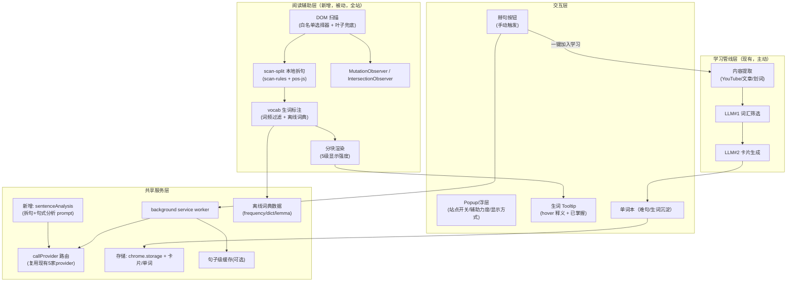

# 捕获生词 阅读辅助功能融合方案
## —— 基于「掰it」为 捕获生词 增加：自动拆长句 / 生词标注 / 手动掰句 / LLM 句式分析

> 参考项目：`bai-it-main`（掰it，v0.2.5，Chrome/Edge/Firefox 英文阅读助手，代码公开、BSL-1.1 许可）
> 目标：把掰it 的四大核心能力**深度融合**进 捕获生词（而非简单复制），复用其成熟算法与数据，同时保留 捕获生词 已有的学习卡片管线。

---

## 目录

1. [参考项目研究结论](#1-参考项目研究结论)
2. [融合目标与设计原则](#2-融合目标与设计原则)
3. [总体融合架构](#3-总体融合架构)
4. [详细设计](#4-详细设计)
5. [与现有 捕获生词 功能的协同](#5-与现有-captiprep-功能的协同)
6. [Manifest 与权限改动](#6-manifest-与权限改动)
7. [分期实施路线图](#7-分期实施路线图)
8. [风险与权衡](#8-风险与权衡)
9. [附录：移植对照清单](#9-附录移植对照清单)

---

## 1. 参考项目研究结论

### 1.1 掰it 是什么

掰it 是一款"英文太长？掰it"的浏览器扩展：把英文网页上的长句**自动拆成看得懂的块**，顺便标注生词，支持手动掰句与可选 LLM 深度分析。零后端、零登录、数据全本地（IndexedDB），且**装完即用**（无需 API Key）。

### 1.2 四大核心能力的实现要点（源码级）

| 能力 | 实现位置 | 技术要点 |
| --- | --- | --- |
| **自动拆长句** | `src/shared/scan-rules.ts` | 纯本地规则 + **pos-js 词性标注消歧**；三级颗粒度（coarse/medium/fine）+ 长短阈值（8/12/18 词）；12 条严格规则（分号/冒号/破折号/括号/并列连词/强·弱从属连词/关系代词/过渡词/从句结束检测…）+ 长句宽松规则 + fine 介词短语规则；<3 词短块合并；3+ 从属标记且拆不动 → `needsLLM` 降级 |
| **生词标注** | `src/shared/vocab.ts` + `data/` | 三层词汇源：行业术语包 > **离线词典 ECDICT**（`dict-ecdict.json` 1.9MB，3.1万词条）> LLM 语境释义；**词频表过滤**（不在 `word-frequency.json` 常用词表 → 标注）；`lemma-map.json` 词形还原（variant→base）+ 简单后缀规则兜底；已掌握词（knownWords）过滤；hover 虚线显示释义 + "已掌握"按钮 |
| **手动掰句** | `src/content/index.ts` `addManualTrigger` | 拆不开的段落旁挂一个掰句按钮；**无 API → 本地强制拆分**（`scanSplit(text,'short','fine')`）；**有 API → LLM 深度分析**；结果渲染后移除按钮并标记 `manual:true` 采集 |
| **LLM 深度分析** | `src/shared/llm-adapter.ts` | 双格式（Gemini + OpenAI 兼容）；`buildChunkPrompt`（骨架优先+缩进从属+不改原文+生词约束）；`buildFullAnalysisPrompt`（chunked + **pattern_key 句式分类** + 中文句式讲解 + 学会表达 + 语境化生词 + is_worth_practicing）；temperature 0.1、JSON 输出 |

### 1.3 掰it 的关键架构决策（值得借鉴）

1. **两级处理：本地优先，LLM 兜底**——绝大多数句子本地规则即时拆（<1ms，零成本），只有"复杂句 + 手动触发"才调 LLM。这是零配置可用的根本。
2. **DOM 注入不破坏页面**——隐藏原始元素（`display:none`）+ 兄弟插入分块元素，保留 React/Fiber 绑定；Twitter Show More 用 `height:0` 塌缩；line-clamp/overflow 截断容器覆盖；含链接元素走 clone + 只动 text node 的 DOM 手术。
3. **采集与分析解耦（懒处理）**——浏览时零成本把句子存 `pending_sentences`，用户打开管理端才按页发 LLM 分析，成本与真实学习行为成正比。
4. **后台批量合并**——50ms 窗口 + 每批 ≤5 句合并发 LLM，句子级 FNV hash 缓存（7 天 TTL），重复句子不重复调用。
5. **三层体验模型**——装完即用（本地）/ 点了更好用（手动掰）/ 配了 key 最好用（LLM 分析）。
6. **POS 增强规则**（`docs/research/local-sentence-chunking.md`）——纯规则的上限在"that/which/to/-ing"消歧，引入 pos-js（~50KB）后拆句质量显著提升；完整句法解析（spacy-wasm 等）因 10-100MB 模型体积被明确否决。

### 1.4 复用价值评估

| 掰it 模块 | 与 捕获生词 的契合度 | 移植难度 |
| --- | --- | --- |
| `scan-rules.ts`（拆句） | 纯逻辑、无依赖（除 pos-js） | 低，直接移植 |
| `vocab.ts`（生词标注） | 纯逻辑、数据驱动 | 低，直接移植 |
| `rule-engine.ts`（英文检测/复杂度） | 纯逻辑 | 低，直接移植 |
| `data/*.json`（词典/词频/词形） | 数据资产，直接复用 | 低（需换加载方式） |
| `renderer.ts`（分块渲染） | 纯 DOM | 低 |
| `content/index.ts`（DOM 扫描/注入） | 需适配 捕获生词 架构 | 中 |
| `llm-adapter.ts`（拆句 prompt） | 功能是 捕获生词 `callProvider` 的子集 | 中（复用现有路由） |
| `db.ts` / options(React) | 捕获生词 已有存储与单词本 | 高（不移植，走融合） |

> **核心判断：掰it 最有价值、最可复用的是"算法层 + 数据层"（scan-rules / vocab / rule-engine / data 词典），这些是纯逻辑、无框架依赖，可直接以原生 JS 形式并入 捕获生词；而它的工程层（IndexedDB 10 表、React 管理端）则融入 捕获生词 既有体系，避免双套系统并存。**

---

## 2. 融合目标与设计原则

### 2.1 融合后 捕获生词 的能力全景

```
捕获生词 融合后 = 阅读辅助（拆句/生词） + 学习管线（卡片/单词本）
                    ↓                      ↓
            任意英文网页实时辅助        沉淀为可复习的学习资产
```

用户要求落地的四项能力：

| 需求 | 落地形态 |
| --- | --- |
| 自动拆长句 | 打开任意英文网页，content script 自动扫描长句 → 本地规则拆块 → 缩进分行展示 |
| 标注生词 | 生词虚线标出，鼠标悬浮显示中文释义（内置离线词典 ECDICT） |
| 手动掰句 | 未拆开的句子旁挂按钮，点击本地强制拆分 |
| LLM 深度分析（可选） | 配置 API Key 后，手动掰句升级为 LLM 句式分析（句式分类+讲解+表达+语境释义），**复用 捕获生词 现有 LLM 提供商配置** |

### 2.2 设计原则

1. **算法即资产**：移植掰it 打磨过的拆句规则与离线词典，不重造轮子；
2. **LLM 配置零重复**：捕获生词 已有 5 家 provider（gemini/openai/anthropic/openrouter/openai-compatible），新增能力直接复用，用户只需配一次 key；
3. **本地优先，LLM 兜底**：默认零配置可用（拆句+词典），配 key 后体验增强；
4. **不破坏页面**：DOM 注入沿用掰it 验证过的"隐藏原元素 + 兄弟插入"策略；
5. **学习沉淀闭环**：阅读中遇到的难句/生词可一键进入 捕获生词 学习管线（卡片/单词本），两个功能域共享数据而非割裂。

---

## 3. 总体融合架构



**核心分层**：新增的"阅读辅助层"与既有的"学习管线层"各自独立运行，只在**共享服务层**（LLM 路由、离线词典、存储、单词本）交汇——避免两个功能域互相耦合。

---

## 4. 详细设计

## 4.1 本地拆句模块（移植 `scan-rules.ts`）

### 移植方式
掰it 的 `scan-rules.ts` 是纯 TypeScript 逻辑（唯一依赖 `pos`，即 pos-js，纯 JS 无依赖）。捕获生词 是原生 JS 零构建，**将其转译为原生 JS 模块 `assets/scan-split.js` 直接引入**。

### 保留的算法核心

```
句子进入 scanSplit(sentence, threshold, granularity)
  ├─ 词数 < 阈值(8/12/18) → 不拆，返回原句
  ├─ pos-js 词性标注（失败优雅降级为 null）
  ├─ splitAtBoundaries：
  │   ├─ 严格规则（12 条）：; 后 / : 后 / — / ( ) / 并列连词(逗号后) /
  │   │   强从属连词 / even+连词 / 弱从属连词(逗号后) / 关系代词(逗号后, that 含报告动词消歧) /
  │   │   过渡词 / 从句结束检测(需像从句开头的词, POS 辅助)
  │   ├─ 宽松规则（medium+fine）：长句中无逗号也拆（并列/弱从属/关系代词/TO+VB 不定式）
  │   └─ fine 额外：介词短语 / how·why·what 从句 / 引语边界
  ├─ 短块合并（<3 词并入相邻块）
  └─ 拆不动 + 3+ 从属标记 → needsLLM=true（交给手动触发时用 LLM）
```

### 适配点（相对掰it 的增量）

| 适配项 | 说明 |
| --- | --- |
| pos-js 本地化 | 将 pos-js 的 `lexicon.js` + `tagger` vendor 进 `assets/vendor/`（~50KB），避免引入 npm 构建 |
| 多语言门控 | 捕获生词 是多语言产品（9 种学习语言）；拆句/标注仅作用于**英文**（`isEnglish` 检测，阈值 0.5），非英文文本跳过，避免误伤日/中/韩阅读 |
| 拆句强度配置 | 复用掰it 的 `chunkIntensity`（1-5）与 `chunkGranularity`（coarse/medium/fine），写入 捕获生词 settings |

## 4.2 生词标注模块（移植 `vocab.ts` + 离线词典）

### 数据资产（直接搬运）

| 文件 | 大小 | 作用 | 捕获生词 落位 |
| --- | --- | --- | --- |
| `word-frequency.json` | 55KB | 常用词表（~5000 词），命中即不标注 | `data/` |
| `dict-ecdict.json` | 1.9MB | 离线词典（3.1 万词条，word→中文释义） | `data/` |
| `lemma-map.json` | 616KB | 词形变体→原形映射（ECDICT exchange 字段生成） | `data/` |
| `modern-vocab.json` | 6KB | 现代词汇包（可选增强） | `data/` |

### 加载方式的适配（关键差异）

掰it 用 esbuild 把 JSON `import` 进 bundle；捕获生词 无构建，采用**异步加载 + 内存缓存**：

1. 词典文件放 `data/` 并声明进 `web_accessible_resources`；
2. content script 首次启用时 `fetch(chrome.runtime.getURL('data/dict-ecdict.json'))` 加载，结果存内存（模块级变量），页面切换不重复加载；
3. 1.9MB JSON 解析 ~几十 ms，可接受；如需优化可改为"字典分片 + 按需加载"（见 §8 风险）。

### 标注规则（保留）

```
annotateWords(text, knownWords)
  ├─ 提取英文词（正则 \b[a-zA-Z][a-zA-Z'-]*[a-zA-Z]\b）
  ├─ 跳过：<3 字母 / 纯数字 / 含特殊字符 / 含撇号缩写(don't等)
  ├─ 词频过滤：lemma 还原后在常用词表 → 不标注
  ├─ 已掌握过滤：knownWords（chrome.storage 持久化）
  └─ 词典查义（lemma 还原后查 dict-ecdict）→ 无释义不标注（不猜测）
```

**虚线下划线 + hover tooltip**：生词包 `<span class="cc-vocab" data-word data-def>`，`text-decoration: underline dotted`，hover 显示释义浮窗 + "已掌握"✓按钮（点击加入 knownWords 并移除本页该词标注）。

## 4.3 DOM 扫描与注入（适配 content script）

### 扫描策略（沿用掰it，精简适配）

1. **白名单选择器**：X/Twitter、Reddit、Medium、`article p`、`main p`、`.content p` 等（适配 捕获生词 的站点矩阵，可配置扩展）；
2. **叶子兜底扫描**：遍历 DOM 找"文本密集、无子块级元素"的叶子块，覆盖白名单外站点；
3. **性能控制**：IntersectionObserver（rootMargin 100%）懒加载 + MutationObserver 监听动态内容 + 100ms/5 元素批量处理，避免卡顿；
4. **注入方式**：隐藏原始元素 + 兄弟插入分块元素，保留框架绑定；line-clamp/overflow 截断覆盖；含链接元素走 clone + 只动 text node。

### 与 捕获生词 现有 content script 的共存

| 场景 | 处理 |
| --- | --- |
| YouTube 页面 | 既有字幕学习浮层不受影响；拆句功能作用于页面描述/评论/字幕（可选开关） |
| 其他英文网页 | 自动拆句 + 生词标注为主；同时可用"提取本文"进入学习管线 |
| 非英文网页 | 自动跳过（isEnglish 门控） |

## 4.4 手动掰句

- 拆不开的段落/句子旁挂"掰"按钮（SVG 图标）；
- **无 API Key**：本地强制拆分（`scanSplit(text, 'short', 'fine')`）；
- **有 API Key**：发 LLM 深度分析（见 §4.5），返回结构化结果后渲染；
- 拆不动则移除按钮，避免无效交互；
- 点击过的句子标记并存入"难句集"（见 §4.7）。

## 4.5 LLM 深度分析（复用 捕获生词 现有路由）

### 关键决策：不移植掰it 的 llm-adapter，直接复用 `background.js` 的 `callProvider`

捕获生词 已支持 5 家 provider 的统一路由（gemini / openai / anthropic / openrouter / openai-compatible），掰it 的 llm-adapter 只是其中 2 家的子集。融合方式：

```
background.js 新增消息：CC_SENTENCE_ANALYSIS
  ├─ 参数：{ sentence, role: 'chunk' | 'full' }
  ├─ 用 捕获生词 现有 settings(provider/apiKey/model) 解析出 LLMConfig
  ├─ 调用现有 callProvider 发请求（temperature 0.1, JSON）
  ├─ 解析（复用 extractJson 或移植 parseChunkJson 的数组/单对象兼容逻辑）
  └─ 返回 ChunkResult / FullAnalysisResult
```

### 两个新增 Prompt（移植自掰it，适配 捕获生词 风格）

**① 拆句 Prompt（role='chunk'）**：骨架优先（主句不缩进）、从句/修饰逐级缩进 2 空格、不改原文、`is_simple` 标记、生词标注约束（不标专有名词/品牌/常见词，宁缺毋滥）。

**② 深度分析 Prompt（role='full'）**：返回
- `chunked`（缩进分块）
- `pattern_key`（11 种句式分类：插入补充 / 先说背景 / 层层嵌套 / 一口气列举 / 倒着说 / 超长主语 / 省略跳跃 / 对比转折 / 条件假设 / 超长修饰 / 其他）
- `sentence_analysis`（中文讲解为什么难读）
- `expression_tips`（值得学的表达模板，加粗标注）
- `new_words`（语境化中文释义）
- `is_worth_practicing`（是否值得练）

> pattern_key 列表在前端映射为用户友好的中文标签 + 一句话解释（与 prompt 解耦，改措辞不改 prompt），非法值兜底为"其他"。

### 缓存（可选，成本控制）

句子级 FNV-1a hash + 7 天 TTL 缓存（移植 `cache.ts` 逻辑到 `chrome.storage.local` 或 IndexedDB），同一句不重复调 API。

## 4.6 配置与 Popup

捕获生词 现有浮层 + options 页可承载以下新设置：

| 设置项 | 类型 | 说明 |
| --- | --- | --- |
| `readingAssistant.enabled` | bool | 阅读辅助总开关（默认开） |
| `readingAssistant.chunkIntensity` | 1-5 | 显示力度（L5 缩进+透明度 … L1 从句变淡） |
| `readingAssistant.granularity` | coarse/medium/fine | 拆句颗粒度 |
| `readingAssistant.threshold` | short/medium/long | 拆句词数阈值 |
| `readingAssistant.disabledSites` | string[] | 站点黑名单（默认全开） |
| `readingAssistant.vocab` | bool | 生词标注开关 |

**Popup 交互**（借鉴掰it）：大按钮"掰it/显示原文"切换当前页 + 站点开关 + 辅助力度滑杆 + 显示方式分段选择器（实时预览）。捕获生词 可把这些做进浮层或独立 popup。

## 4.7 数据与学习沉淀

| 数据类型 | 存储 | 说明 |
| --- | --- | --- |
| knownWords（已掌握） | `chrome.storage.local` | 阅读标注过滤；**反哺 LLM#1 候选筛选**（已知词不入候选） |
| 难句记录 | `CCAPTIPREPS:content:{hash}`（复用现有内容键） | 手动掰过的句子 + 拆句结果 + LLM 分析，进入单词本"难句"视图 |
| 生词 | 收藏快照 `CCAPTIPREPS:fav:words` | 阅读中遇到的高价值生词可一键收藏 |
| 学习卡片 | 现有 cards 体系 | 难句可"一键生成学习卡片"（进入 LLM#2 管线） |

---

## 5. 与现有 捕获生词 功能的协同

融合不是两套功能并列，而是互相增强：

```
阅读辅助层                          学习管线层
────────────────────────────────────────────────────────
① 拆句/标注只读页面                  ① YouTube/文章/划词提取
② 难句/生词 (被动积累)  ──一键导入──▶ ② 学习卡片 + 单词本 (主动沉淀)
③ knownWords(已掌握)  ──过滤反哺──▶ ③ LLM#1 候选筛选(已知词不入选)
④ 读到的句子 ──"提取本文"──▶ ④ ArticleAdapter 正文管线(上一轮通用化方案)
⑤ 共用 settings / provider / LLM 路由
```

**协同收益**：
- 捕获生词 已有的 LLM 提供商体系（用户若配过 key）被新功能直接复用，无重复配置；
- 阅读时顺手收藏的生词/难句自动进入单词本，形成"阅读 → 学习"闭环；
- knownWords 让 LLM#1 的候选筛选越来越精准（与 捕获生词 现有 `alignCardsToSelected` 等后处理互补）。

---

## 6. Manifest 与权限改动

```jsonc
{
  "permissions": [
    "storage", "scripting", "activeTab",
    "contextMenus"            // 新增：右键"掰这句/提取本文/收藏生词"
  ],
  "host_permissions": [
    // 新增：全站注入需要（与上一轮"按需注入"方案取平衡，见 §8 权衡）
    "*://*/*",
    "https://api.openai.com/*", "https://api.anthropic.com/*",
    "https://openrouter.ai/*", "https://generativelanguage.googleapis.com/*"
  ],
  "content_scripts": [{
    "matches": ["*://*/*"],           // 从仅 YouTube 扩展为全站
    "js": ["content.js", "ui.js"],
    "run_at": "document_idle"
  }],
  "web_accessible_resources": [{
    "resources": ["page_inject.js", "assets/*", "data/*", "icons/*"],
    "matches": ["*://*/*"]
  }]
}
```

> **权限权衡**：全站注入与"打开任何英文网页自动拆"强绑定，必须静态注入 `<all_urls>`；这与上一轮"按需注入"方案相冲突。折衷：content script 静态注入但默认**不激活**（`readingAssistant.enabled` 默认开则默认激活；提供站点黑名单与总开关，隐私敏感用户可一键关闭）。商店审核时 `<all_urls>` 需在描述中如实说明用途。

---

## 7. 分期实施路线图

### Phase 1 —— 阅读辅助 MVP（零配置可用）

| 交付物 | 来源 | 说明 |
| --- | --- | --- |
| `assets/scan-split.js` | 移植 scan-rules + pos-js | 本地拆句算法 |
| `assets/vocab.js` | 移植 vocab + rule-engine | 英文检测 + 生词标注 |
| `data/` 离线词典 | 搬运 4 个 JSON | 异步加载 + 内存缓存 |
| DOM 扫描/注入 | 适配 content/index.ts | 白名单 + 叶子兜底 + Observer |
| 手动掰句（本地模式） | 适配 addManualTrigger | 无 key 本地强制拆 |
| 设置项 + 站点开关 | 扩展 settings/浮层 | 总开关/力度/黑名单 |
| **验收** | — | 任意英文网页长句自动拆块、生词虚线下划线 hover 出释义 |

### Phase 2 —— LLM 深度分析（配 key 增强）

| 交付物 | 说明 |
| --- | --- |
| `CC_SENTENCE_ANALYSIS` 消息 + 两个 prompt | 复用 callProvider；拆句/句式分类/讲解/表达/语境释义 |
| 句式分类前端映射 | 11 种标签 + 一句话解释 |
| 句子级缓存 | FNV hash + 7 天 TTL |
| 手动掰句升级 | 有 key → LLM 深度分析 |
| **验收** | 手动掰一个难句 → 返回分块+句式讲解+学会表达 |

### Phase 3 —— 学习沉淀闭环

| 交付物 | 说明 |
| --- | --- |
| 难句集（单词本新视图） | 收集手动掰过的句子 + 分析结果 |
| 生词一键收藏 / knownWords 反哺 LLM#1 | 双向协同 |
| 阅读辅助 ↔ 学习管线互转 | 难句一键生成学习卡片；"提取本文"进正文管线 |
| **验收** | 阅读中收藏的生词/难句在单词本可见、可复习、可导出 |

---

## 8. 风险与权衡

| 风险 | 影响 | 缓解 |
| --- | --- | --- |
| `<all_urls>` 权限扩大 | 商店审核、隐私疑虑 | 总开关 + 站点黑名单 + 如实声明用途；可选"按需激活" |
| 1.9MB 词典加载 | content script 启动变慢 | 异步 fetch + 内存缓存 + 首次启用才加载；必要时分片 |
| 全站 DOM 扫描性能 | 大页面卡顿 | IntersectionObserver 懒加载 + 批量处理 + 叶子检测门控 |
| 拆句误拆 | 破坏阅读体验 | 沿用掰it 打磨的规则 + 短块合并 + 非英文跳过 + 显示强度可调 |
| 与既有 YouTube 浮层冲突 | 页面注入互相干扰 | 功能域分层；YouTube 上拆句仅作用于描述/评论 |
| pos-js 体积/许可 | 增加 ~50KB | pos-js 为 MIT 许可、纯 JS，vendor 时保留版权声明 |
| 词典数据许可 | ECDICT 为开源数据 | 保留 ECDICT 声明（掰it 已内置，随其数据来源注明） |

---

## 9. 附录：移植对照清单

| 掰it 文件 | 处置 | 捕获生词 落位 |
| --- | --- | --- |
| `shared/scan-rules.ts` | 转译为原生 JS | `assets/scan-split.js` |
| `shared/vocab.ts` | 转译为原生 JS | `assets/vocab.js` |
| `shared/rule-engine.ts` | 转译为原生 JS（isEnglish/复杂度） | `assets/vocab.js` 或独立 |
| `shared/llm-adapter.ts`（prompt） | 移植两个 prompt | `background.js`（新增 role） |
| `shared/cache.ts` | 移植 hash + TTL 逻辑 | 并入 background/存储 |
| `content/renderer.ts` | 适配 | `ui.js` 或新 `assets/reader-render.js` |
| `content/index.ts`（扫描/注入/触发） | 适配重构 | 新 content 子模块（与现有 content.js 并存） |
| `data/*.json` | 直接搬运 | `data/` |
| `popup/index.ts` | 借鉴交互 | 融入浮层或独立 popup |
| `options`(React) / `db.ts`(10表) | **不移植** | 融入 捕获生词 单词本与既有存储 |
| `background/index.ts` | 不移植 | 复用 捕获生词 `callProvider` 路由 |

---

## 附：实现建议顺序（开发视角）

1. 先搬 `data/` 词典 + `assets/vocab.js` + `assets/scan-split.js`（纯逻辑，单测覆盖）；
2. 实现 content 扫描/注入的**最小闭环**（打开英文页 → 拆句 → 标注 → hover 释义）；
3. 加手动掰句（本地强制拆）；
4. 接 `CC_SENTENCE_ANALYSIS`（复用 callProvider）+ 缓存；
5. 最后做学习沉淀闭环与 UI 设置项。

> 该方案的关键价值：**用最小成本（复用成熟算法 + 复用现有 LLM 路由）让 捕获生词 具备"任意英文网页阅读辅助"能力，同时不破坏其 YouTube 学习管线，并最终通过"难句/生词 → 学习卡片"实现阅读与学习的闭环。**
