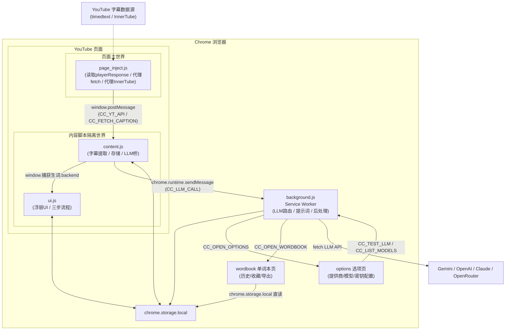
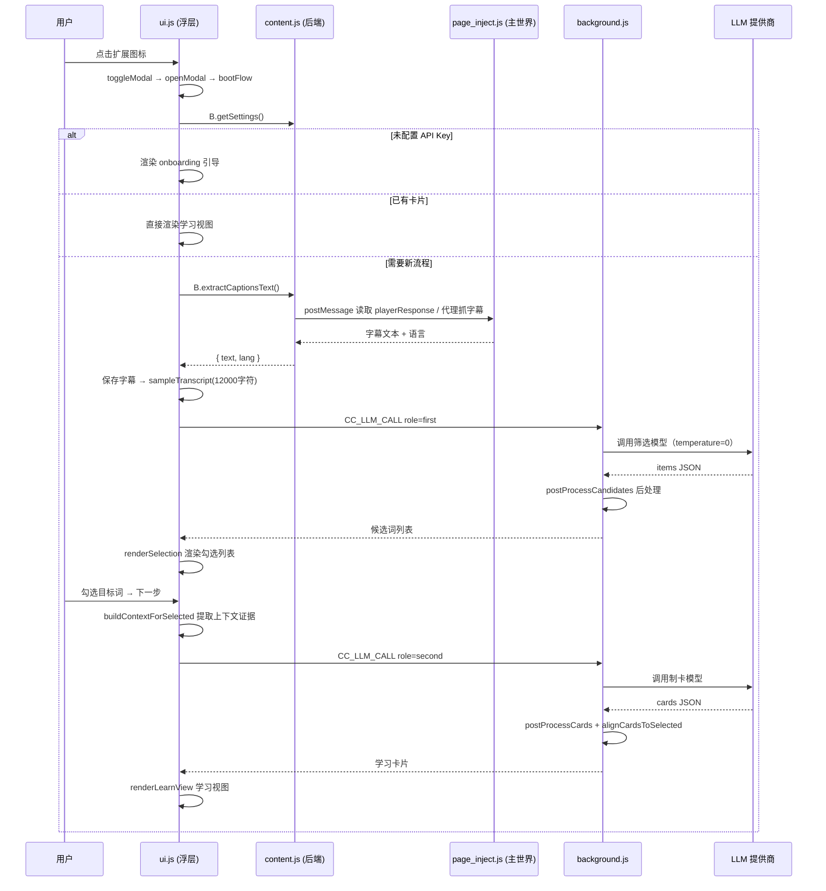
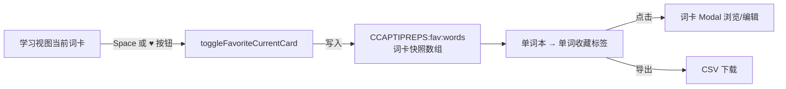

# 捕获生词 项目说明文档

> 版本：v1.5.0 ｜ 类型：Chrome 浏览器扩展（Manifest V3）｜ 核心定位：AI 驱动的 YouTube 语言学习助手


***

## 目录


1. [项目概述](#1-项目概述)

2. [技术栈与目录结构](#2-技术栈与目录结构)

3. [总体架构](#3-总体架构)

4. [功能模块详解](#4-功能模块详解)

5. [业务逻辑流程](#5-业务逻辑流程)

6. [核心原理](#6-核心原理)

7. [数据存储设计](#7-数据存储设计)

8. [消息通信协议](#8-消息通信协议)

9. [关键设计决策](#9-关键设计决策)

10. [潜在问题与改进建议](#10-潜在问题与改进建议)


***

## 1. 项目概述

**捕获生词 = Caption + Preparation（字幕 + 预习）。**

它是一款运行在 YouTube 页面上的 Chrome 扩展，核心理念是 "**先学再看（Pre-exposure）**"：在看视频之前，先从该视频的字幕中提取关键单词与表达，让 AI 生成学习卡片供用户预习；之后再观看视频，通过视频上下文自然巩固记忆，实现"Contextual Learning（情境化学习）"。

### 1.1 核心功能


| 功能      | 说明                                                                           |
| ------- | ---------------------------------------------------------------------------- |
| 自动字幕提取  | 从当前 YouTube 视频抓取原始字幕，严格跟随当前选中的字幕轨，避开自动翻译轨                                    |
| AI 词汇初筛 | 用大模型（LLM #1）从字幕中提取高价值单词 / 短语候选，并进行证据校验、停用词过滤、脚本门控等后处理                        |
| 手动精筛    | 浮层面板中以复选框列表展示候选词，用户可全选 / 取消，确认生成范围                                           |
| 学习卡片生成  | 用大模型（LLM #2）为每个选定词生成含发音、词性、释义、双语例句、语法备注的完整学习卡片                               |
| 单词本     | 独立页面，按日期分组展示历史学习视频与收藏单词，支持查看、编辑、删除、CSV 导出                                    |
| 多语言支持   | 9 种学习语言（英 / 中简 / 中繁 / 日 / 韩 / 俄 / 法 / 德 / 西），释义语言与界面语言可独立配置                  |
| 多模型提供商  | 支持 Google Gemini、OpenAI、Anthropic Claude、OpenRouter、OpenAI 兼容接口，API Key 本地存储 |

### 1.2 为什么有效（产品逻辑）


* **Pre-exposure**：观看前先消除词汇障碍，降低理解门槛；

* **Real context**：例句全部来自用户将要观看的视频本身，记忆更牢固；

* **Accumulation**：所有学习内容沉淀进单词本，便于间隔复习与迁移。


***

## 2. 技术栈与目录结构

### 2.1 技术栈


* **平台**：Chrome Manifest V3（MV3），原生 JS（无框架、无构建工具、无依赖）

* **后台**：Service Worker（ES Module），负责 LLM 调用路由与设置管理

* **前端**：原生 DOM 操作 + 内联 SVG 图标，无第三方 UI 库

* **样式**：手写 CSS（`assets/cc.css`），黑白色 Neo-brutalism 风格（粗边框 + 硬阴影）

* **存储**：`chrome.storage.local`（本地存储，无远端服务器）

* **通信**：`chrome.runtime.sendMessage`（扩展内部）+ `window.postMessage`（注入主世界通信）

* **多语言**：`_locales/`（manifest i18n）+ `assets/i18n/*.json`（运行时动态语言包）

### 2.2 目录结构


```
捕获生词-main/

├── manifest.json            # MV3 扩展清单（权限、入口、资源声明）

├── background.js            # 后台 Service Worker：设置、LLM 路由、提示词构建、后处理

├── content.js               # 内容脚本（后端层）：字幕提取、存储、LLM 桥接，暴露 window.捕获生词.backend

├── ui.js                    # 内容脚本（UI 层）：浮层面板、交互、渲染、学习流程状态机

├── page\_inject.js           # 注入页面主世界的脚本：读取 playerResponse、代理 fetch / InnerTube API

├── options/

│   ├── index.html           # 设置页 HTML

│   └── options.js           # 设置页逻辑（提供商配置、模型管理、自动保存）

├── assets/

│   ├── cc.css               # 浮层与单词本共享样式

│   ├── ui.html              # 浮层面板 HTML 模板

│   ├── wordbook.html        # 单词本页面 HTML

│   ├── wordbook.js          # 单词本页面逻辑

│   ├── i18n/{en,zh\_CN}.json # 运行时语言包

│   ├── CHANGELOG.en.md      # 更新日志（英文）

│   └── CHANGELOG.zh\_CN.md   # 更新日志（中文）

├── \_locales/{en,zh\_CN}/messages.json   # manifest 级 i18n 消息

├── icons/                   # 多尺寸扩展图标

└── README\*.md               # 多语言 README
```

### 2.3 manifest.json 关键配置


```
{

&#x20; "manifest\_version": 3,

&#x20; "version": "1.5.0",

&#x20; "permissions": \["storage", "scripting", "activeTab"],

&#x20; "host\_permissions": \[

&#x20;   "https://www.youtube.com/\*", "https://\*.youtube.com/\*", "https://\*.googlevideo.com/\*",

&#x20;   "https://api.openai.com/\*", "https://api.anthropic.com/\*",

&#x20;   "https://openrouter.ai/\*", "https://generativelanguage.googleapis.com/\*",

&#x20;   "\<all\_urls>"

&#x20; ],

&#x20; "background": { "service\_worker": "background.js", "type": "module" },

&#x20; "options\_page": "options/index.html",

&#x20; "content\_scripts": \[{

&#x20;   "matches": \["https://\*.youtube.com/\*", "https://youtu.be/\*"],

&#x20;   "js": \["content.js", "ui.js"],

&#x20;   "run\_at": "document\_idle"

&#x20; }],

&#x20; "web\_accessible\_resources": \[{

&#x20;   "resources": \["page\_inject.js", "assets/\*", "icon.png", "icons/\*"],

&#x20;   "matches": \["https://\*.youtube.com/\*", "https://youtu.be/\*"]

&#x20; }]

}
```

> 注意：
>
> `content.js`
>
> （后端层）与 
>
> `ui.js`
>
> （UI 层）作为两个独立文件先后注入同一页面，通过 
>
> `window.捕获生词.backend`
>
>  这个全局对象解耦。
>
> `ui.js`
>
>  中被刻意大量使用 
>
> `var`
>
>  与 
>
> `window`
>
>  命名空间保护，以避免脚本被重复注入时出现 
>
> `const`
>
>  重复声明错误。


***

## 3. 总体架构

### 3.1 运行时组件


| 组件                                   | 运行环境                | 职责                                                                |
| ------------------------------------ | ------------------- | ----------------------------------------------------------------- |
| `background.js`                      | 扩展 Service Worker   | 设置存取、LLM 调用路由（含提示词构建与结果后处理）、打开选项页 / 单词本、测试与列举模型、存储清理              |
| `content.js`                         | YouTube 页面（隔离世界）    | 字幕提取管线、按视频读写本地存储、与 UI 交互的后端 API 桥                                 |
| `ui.js`                              | YouTube 页面（隔离世界）    | 浮层 UI、三步流程状态机、卡片渲染 / 编辑、收藏、导出                                     |
| `page_inject.js`                     | YouTube 页面（**主世界**） | 突破内容脚本隔离，读取 `ytInitialPlayerResponse`、代理字幕 fetch、代理 InnerTube API |
| `options/index.html + options.js`    | 扩展选项页               | 提供商 / API Key / 模型 / 语言配置                                         |
| `assets/wordbook.html + wordbook.js` | 扩展独立标签页             | 历史记录与收藏管理、CSV 导出                                                  |

### 3.2 架构图




### 3.3 分层解耦设计

项目采用了清晰的**前后端分层**：


* **后端（content.js）**：不关心 UI，只负责 "能做什么"—— 取字幕、存数据、调 LLM，最终把能力挂载到 `globalThis.CaptiPrep.backend`；

* **前端（ui.js）**：不关心实现细节，只通过 `B = globalThis.CaptiPrep.backend` 调用后端 API（`B.getSettings`、`B.llmCall`、`B.loadVideoData`、`B.saveVideoData`、`B.extractCaptionsText` 等）。

这种解耦使得：


1. UI 与数据 / 网络逻辑互不污染；

2. `ui.js` 被重复注入（如点击图标时 content script 尚未就绪而被重新 `executeScript`）时，`var B` 会复用已存在的 backend 而不报错；

3. 单词本页面与浮层共享同一套存储键与卡片数据结构。


***

## 4. 功能模块详解

## 4.1 设置与提供商管理模块（`options/`）

### 职责

配置 LLM 提供商、API Key、Base URL、模型（分角色）、界面语言、释义语言，并自动保存到 `chrome.storage.local`。

### 核心机制

**1）按提供商分档保存配置（Profiles）**


```
PROFILES = { \[provider]: { apiKey, baseUrl, modelFirst, modelSecond } }
```

每个提供商（gemini /openai/anthropic /openrouter/openai-compatible）有独立的一套配置，通过 `settingsProfiles` 键持久化。切换提供商时自动载入对应档位；Gemini 作为默认提供商在档位为空时注入默认模型（`gemini-2.5-flash-lite` / `gemini-2.5-flash`）。

**2）扁平化兼容层**


```
settings = {

&#x20; provider, baseUrl, model, modelFirst, modelSecond,

&#x20; apiKey, glossLang, uiLang

}
```

除分档配置外，同时把当前激活档位的字段扁平化写入 `settings` 键，供后台 Service Worker 直接读取（`getSettings()`），保证老版本兼容。

**3）自动保存（debounce）**

所有输入框 / 下拉框监听 `input` / `change` 事件，400ms 防抖后自动写入存储，无需手动点保存。

**4）模型管理**


* **获取模型列表**：`fetchModels` 通过 `CC_LIST_MODELS` 消息让后台按提供商调用对应 `/models` 接口，结果缓存后用于输入框自动补全（下拉建议、键盘上下键选择）；

* **单模型测试**：`testModel` 通过 `CC_TEST_LLM` 消息发送 `{"ok":true}` 测试请求，验证 API Key 与模型可用性；

* **API Key 显示开关**：眼睛图标切换 `password` / `text` 输入类型。

### 提供的设置项


| 设置项           | 说明                                                                |
| ------------- | ----------------------------------------------------------------- |
| `provider`    | LLM 提供商（默认 `gemini`）                                              |
| `apiKey`      | API 密钥（本地存储）                                                      |
| `baseUrl`     | 自定义 Base URL（可选，兼容第三方 / 代理网关）                                     |
| `modelFirst`  | 词汇筛选模型（LLM #1，默认 `gemini-2.5-flash-lite`）                         |
| `modelSecond` | 卡片生成模型（LLM #2，默认 `gemini-2.5-flash`）                              |
| `glossLang`   | 释义语言（`auto` / en / zh\_CN / zh\_TW / ja / ko / ru / fr / de / es） |
| `uiLang`      | 界面语言（`auto` / en / zh\_CN）                                        |


***

## 4.2 LLM 调用与路由模块（`background.js`）

### 职责

统一接收来自内容脚本 / 选项页的 LLM 相关消息，构建提示词、调用对应提供商 API、解析并后处理结果。

### 消息路由（`chrome.runtime.onMessage`）


| 消息类型               | 来源                 | 功能                                |
| ------------------ | ------------------ | --------------------------------- |
| `CC_LLM_CALL`      | content.js         | 执行两阶段 LLM 管线（role: first /second） |
| `CC_GET_SETTINGS`  | content.js / ui.js | 返回合并默认值的设置                        |
| `CC_OPEN_OPTIONS`  | ui.js              | 打开选项页                             |
| `CC_OPEN_WORDBOOK` | ui.js              | 新标签页打开单词本                         |
| `CC_TEST_LLM`      | options.js         | 测试指定模型连通性                         |
| `CC_LIST_MODELS`   | options.js         | 按提供商列举可用模型                        |

### 两阶段 LLM 管线（`handleLLMCall`）

这是项目最核心的业务逻辑，采用**两个独立模型角色分工**：


```
角色 first  (LLM #1)  →  词汇筛选：字幕 → 候选词/短语列表

角色 second (LLM #2)  →  卡片生成：选定词 → 完整学习卡片
```


| 阶段       | 输入                             | 输出 JSON                                                                                                                | 后处理                                                                        |
| -------- | ------------------------------ | ---------------------------------------------------------------------------------------------------------------------- | -------------------------------------------------------------------------- |
| `first`  | 字幕采样文本（≤12000 字符）+ 语言提示        | `{ "items": [{ "term", "type": word\|phrase, "freq" }] }`                                                              | `postProcessCandidates`：证据校验、停用词过滤、脚本门控、去重、频率排序、数量封顶 + 多级兜底                |
| `second` | 用户选定的词列表 + 字幕上下文证据 + 语言 / 口音配置 | `{ "cards": [{ "term", "reading", "ipa", "ipa_us", "ipa_uk", "pos", "definition", "examples", "notes", "grammar" }] }` | `postProcessCards`：POS 中文映射、IPA 语言规则、例句规范化、`alignCardsToSelected` 对齐用户选择顺序 |

**采样参数**：两个角色均使用 `temperature = 0`、`topP = 1`，以降低幻觉、保证可复现性。

### 提供商适配器（`callProvider`）

以统一签名 `callProvider({ provider, baseUrl, apiKey, model, prompt, temperature, topP })` 封装 5 种提供商：


| 提供商                        | 默认端点                                                                                      | 认证方式                              | 响应解析                                 |
| -------------------------- | ----------------------------------------------------------------------------------------- | --------------------------------- | ------------------------------------ |
| gemini                     | `https://generativelanguage.googleapis.com/v1beta/models/{model}:generateContent?key=...` | URL query key                     | `candidates[0].content.parts[].text` |
| openai / openai-compatible | `https://api.openai.com/v1/chat/completions`                                              | Bearer Token                      | `choices[0].message.content`         |
| claude / anthropic         | `https://api.anthropic.com/v1/messages`                                                   | `x-api-key` + `anthropic-version` | `content[0].text`                    |
| openrouter                 | `https://openrouter.ai/api/v1/chat/completions`                                           | Bearer Token                      | `choices[0].message.content`         |

支持 `baseUrl` 覆盖，因此可接入任何 OpenAI 兼容网关 / 代理。

### JSON 鲁棒解析（`extractJson`）

LLM 输出经常带 Markdown 代码围栏、前后缀文本。`extractJson` 实现多级解析：


1. 优先提取 `json` 代码围栏内容；

2. 对每个候选先尝试直接 `JSON.parse`；

3. 失败则用**平衡括号扫描器**（`findBalancedJsonBlock`）从第一个 `{` 或 `[` 开始按字符串 / 转义感知扫描，找到第一个完整的平衡 JSON 块；

4. 兜底用正则截取第一段 `{...}` 或 `[...]`。


***

## 4.3 字幕提取模块（`content.js` + `page_inject.js`）

### 难点与方案

**难点**：内容脚本运行在 "隔离世界"，无法直接读取页面主世界的 `ytInitialPlayerResponse`；同时 `https://www.youtube.com/api/timedtext` 字幕接口存在跨域限制，内容脚本直接 `fetch` 会被 CORS 拦截。

**方案**：通过 `web_accessible_resources` 暴露 `page_inject.js`，用 `<script>` 标签把它注入到**页面主世界**执行，再通过 `window.postMessage` 与隔离世界通信。

### 字幕提取管线（`extractCaptionsText`）

采用 "优先直取 + 回退刷新" 的多级策略：


```
① 直接读取页面 playerResponse 中的 captionTracks

&#x20;  └─ 从 ytInitialPlayerResponse / ytplayer.config / ytPlayerConfig 读取

&#x20;  └─ 选择最合适的字幕轨（chooseDefaultTrack）

&#x20;  └─ 按 fmt=json3 → srv3 → vtt 依次尝试抓取解析

② 回退：调用 InnerTube /player 接口刷新 playerResponse

&#x20;  └─ 通过 page\_inject.js 主世界代理 POST（携带页面 INNERTUBE\_API\_KEY / clientVersion / visitorData）

&#x20;  └─ 重新解析 captionTracks 并抓取

③ 均失败 → 抛错"此视频没有可用的字幕"
```

### 字幕轨选择策略（`chooseDefaultTrack`）


* 过滤掉翻译轨（URL 含 `tlang=`）；

* 若用户当前选中了非翻译轨，则优先按其 `languageCode + kind`（或 `vssId`）精确匹配，**尊重用户的语言选择**；

* 否则优先选 \*\* 非自动生成（非 asr）\*\* 的原始字幕轨；

* 这样设计的目的是**严格避免自动翻译字幕混入**，保证提取的是原语种字幕（语言学习需要原文）。

### 字幕格式解析


| 格式           | 解析方式                                                  |
| ------------ | ----------------------------------------------------- |
| JSON3 / srv3 | `captionsJsonToText`：遍历 `events[].segs[].utf8` 拼接每行   |
| WebVTT       | `captionsVttToText`：剥离 BOM、时间戳行、`NOTE` 行、HTML 标签，按块合并 |

### 页面信息提取（`getYouTubeVideoInfo`）


* **videoId**：优先取 URL `?v=` 参数；兼容 `/shorts/<id>`、`youtu.be/<id>`；

* **标题**：按 `可见 H1 → meta[og:title] → twitter:title → itemprop=name → document.title` 优先级取首个非空值，规避 SPA 导航时 meta 滞后问题。


***

## 4.4 词汇筛选模块（LLM #1 + 后处理）

### 提示词工程要点（`buildPrompts` role=first）


* **语言门控（langGate）**：按检测到的源语言注入硬性约束，例如：


  * 英语：只保留英文原词，允许撇号 / 连字符，禁止音译；

  * 日语：使用字幕中的原形（假名 / 汉字混合），禁止用罗马字作词条；

  * 中文：只保留汉字原文，禁止输出拼音作词条；

  * 韩语 / 俄语等各有对应规则；

* **教学价值排序**：语义密度 > 惯用搭配 > 局部频率；

* **停用词清单**：内置 9 种语言的填充词 / 语气词（如 en: uh/um/like；ja: えっと / あの；ko: 어/음 等）；

* **形态约束**：输出 `term` 必须使用字幕中的**表面形式（surface form）**，不做词元还原；

* **证据约束**：`term` 必须在字幕原文中出现过，否则宁可不输出。

### 后处理管线（`postProcessCandidates`）

AI 输出不可信，需逐层清洗：


```
LLM 输出 items

&#x20; ├─ ① 证据校验（contains）：

&#x20; │    拉丁/西里尔文字 → Unicode 感知词边界正则（\p{L}\p{M}\p{N}'- 作为词内字符）

&#x20; │    中日韩/韩文 → 全文字符串 substring 匹配

&#x20; ├─ ② 脚本门控（scriptOk）：按源语言检查字符集

&#x20; │    日语需含假名/汉字；韩语需含谚文；中文需含汉字；俄语需含西里尔字母

&#x20; ├─ ③ 停用词过滤（isStop）：丢弃纯数字/标点、高数字占比、命中停用词表

&#x20; ├─ ④ 按 term 去重合并（拉丁文字大小写不敏感），合并 freq

&#x20; ├─ ⑤ 按 freq 降序排序 + maxItems（默认 60）封顶

&#x20; └─ ⑥ 三级兜底：

&#x20;      if 过滤后为空 → 用"宽松子串匹配"再过滤一次

&#x20;      if 仍为空 → 直接取 LLM 原始 items 中含字母的前 N 项

&#x20;      if LLM 为空 → buildNaiveCandidatesFromTranscript 本地统计词频兜底
```

这套 \*\*"宁可宽松也不让 UI 空转"\*\* 的多级兜底设计，保证用户不会遇到空列表死胡同。


***

## 4.5 学习卡片生成模块（LLM #2 + 后处理）

### 提示词工程要点（`buildPrompts` role=second）


* **源语言推断**：优先用 `captionLang`，若存在则用 `inferLangFromSelected` 从用户选定的词中按字符集 / 重音符 / 功能词特征二次推断，防止跨语言污染；

* **释义语言（gloss）控制**：`definition` 与 `notes` 的撰写语言由 `glossLang` 决定（如中文 / 繁体中文时要求用对应中文写释义）；

* **发音规则分语言定制（ipaRule /pronGuide/readingGuide）**：


| 源语言           | reading 字段                  | ipa 字段                                            |
| ------------- | --------------------------- | ------------------------------------------------- |
| 英语            | 留空                          | 同时给 `ipa_us` + `ipa_uk`，主音标跟随设定口音                 |
| 中文            | 汉语拼音（带声调 ü）                 | 留空                                                |
| 日语            | 假名读音 + NHK 音调数字（如 `あめ [0]`） | 留空                                                |
| 韩语            | 国语罗马字（RR，如 시=si）            | 留空（强制清空）                                          |
| 俄 / 法 / 德 / 西 | 留空                          | IPA（俄语标注重音与腭化 ʲ，法语含鼻元音，德语含长元音 ː 与 ç/x，西语中性 seseo） |


* **例句规则**：每个词恰好 2 组例句对，每组是**两行字符串**—— 第一行源语例句、第二行释义语言翻译，**不包含发音行**；

* **证据约束（evidence）**：把每个选定词在字幕原文中出现的上下文片段（每词最多 2 处，各前后 80 字符）作为消歧依据传入，要求释义贴合视频真实语境；语境不足时允许在 notes 标注 `insufficient_context`；

* **POS 语言化**：中文释义时要求用中文词性（名词 / 动词 /…），俄 / 法 / 德 / 西等可在 notes 补充性 / 格 / 变位 / 可分前缀等信息。

### 后处理管线（`postProcessCards`）


```
LLM 输出 cards

&#x20; ├─ ① 字段兜底：缺失 reading/ipa 等字段补空字符串

&#x20; ├─ ② 去冗余读音：中日韩词条 reading 与 term 完全相同时清空 reading

&#x20; ├─ ③ POS 本地化：中文释义时将英文 POS 映射为中文（noun→名词…），繁体再转换（名词→名詞）

&#x20; ├─ ④ IPA 语言规则强制：英语确保 ipa\_us/ipa\_uk 并回填 ipa；中日韩清空 ipa；韩语强制清空 ipa

&#x20; ├─ ⑤ 字符串 trim

&#x20; ├─ ⑥ 例句规范化（normalizeExamples）：每组取前 2 行，去除行首列表符号，强制两行（源语+翻译）

&#x20; └─ ⑦ alignCardsToSelected：按用户选择顺序重排卡片，

&#x20;      缺失的项以 { term, ..., notes:'insufficient\_context' } 占位补齐

&#x20;      保证"选了 N 个词，就得到 N 张卡，顺序一致"
```


***

## 4.6 浮层 UI 与交互模块（`ui.js`）

### UI 构建


* `createUI()` 动态创建 `#cc-root` 挂到 `document.documentElement`，注入 `assets/cc.css` 与 `assets/ui.html` 模板；

* 顶部加载运行时语言包（`assets/i18n/{uiLang}.json`），执行 `applyI18nPlaceholders` 替换 `__MSG_*__` 占位符；

* 支持 `whatsNew` 更新提示浮层（按版本号读取 CHANGELOG 对应段落，标记 `cc_whatsnew_seen` 后不再弹）。

### 三步进度条（`setStep`）


```
\[配置 LLM] → \[筛选词汇] → \[生成卡片]
```

对应 `currentState` 状态机的三个里程碑；当进入 "生成卡片" 后，"筛选词汇" 步骤可点击回跳，反之亦然（上下文相关的可点击步骤导航）。

### 键盘交互（关键 UX）


| 按键        | 行为            |
| --------- | ------------- |
| `←` / `→` | 切换上一张 / 下一张卡片 |
| `Space`   | 收藏 / 取消收藏当前词卡 |
| `Esc`     | 关闭浮层          |

> 实现细节：在 
>
> `keydown`
>
>  / 
>
> `keypress`
>
>  / 
>
> `keyup`
>
>  三个阶段都拦截空格并 
>
> `stopPropagation`
>
> ，避免空格事件穿透到 YouTube 触发播放 / 暂停；且在输入框 / 文本框聚焦时不拦截。

### 视图模式


* **卡片视图**（大卡片）：显示词条、发音（美 / 英音标分别展示）、词性、释义、双语例句、备注；

* **网格视图**：全部卡片缩略平铺，点击任意卡片跳回对应卡片视图；

* **编辑模式**：就地编辑 term /reading/ipa /pos/definition /examples/notes，保存后写回存储。

### 收藏（Favorites）

当前词卡以 \*\* 快照（snapshot）\*\* 形式存入 `CCAPTIPREPS:fav:words`，包含 `{ videoId, title, cardIndex, snapshot, savedAt }`，即使源视频记录被删除，收藏词卡仍然保留 —— 这是 "收集即沉淀" 的产品设计。

### 导出（`exportCSV`）

把当前视频的卡片导出为带 BOM（`\ufeff`，Excel 兼容）的 CSV，文件名取视频标题（非法字符替换为 `_`）。


***

## 4.7 单词本模块（`assets/wordbook.js` + `wordbook.html`）

独立扩展标签页，三类标签：


| 标签   | 数据来源                                                  | 展示                                             |
| ---- | ----------------------------------------------------- | ---------------------------------------------- |
| 历史记录 | 遍历 `chrome.storage.local` 中 `CCAPTIPREPS:video:*` 前缀键 | 按日期分组展示视频卡片（封面 + 标题 + 前 30 个词条），支持全选 / 删除 / 导出 |
| 视频收藏 | `CCAPTIPREPS:fav:videos`（videoId 集合）                  | 对历史记录做过滤                                       |
| 单词收藏 | `CCAPTIPREPS:fav:words`（词卡快照）                         | 词卡网格，支持全选 / 删除 / 导出                            |

### 核心能力


* **视频详情**：点击视频卡片打开 Modal，展示封面 + 词卡网格；点击某张词卡再打开**二级词卡 Modal**，支持左右切换、编辑、收藏、保存；

* **视频封面**：用 `https://i.ytimg.com/vi/{id}/maxresdefault.jpg` 拉取，失败自动降级 `hqdefault.jpg`；

* **存储联动**：注册 `chrome.storage.onChanged` 监听，收藏数据在其它标签页变化时实时刷新 UI；

* **键盘导航**：与浮层一致的 `←`/`→`/`Space`/`Esc`，通过全局 `__activeKeyNav` 上下文动态切换行为；

* **导出**：历史 / 收藏均可选择条目后批量导出为 CSV（词卡字段：term, ipa, pos, definition, notes, examples）。


***

## 4.8 国际化模块（i18n）

项目有**两套并行的 i18n 机制**：


| 机制                       | 用途                      | 文件                                  |
| ------------------------ | ----------------------- | ----------------------------------- |
| Manifest 级 `chrome.i18n` | 扩展名称 / 描述 / 权限提示等静态文案   | `_locales/{en,zh_CN}/messages.json` |
| 运行时语言包                   | 浮层 / 单词本 / 选项页的动态 UI 文案 | `assets/i18n/{en,zh_CN}.json`       |


* UI 语言通过 `uiLang` 设置（`auto` 跟随浏览器），加载对应 JSON 后统一替换 DOM 中的 `__MSG_key__` 占位符（含 `title` / `placeholder` / `aria-label` / `alt` 等属性）；

* 学习语言（`glossLang`）独立于界面语言，支持 9 种，由 `normalizeLang` 统一归一化（如 `zh-hans`→`zh_CN`，`zh-hant`→`zh_TW`）。


***

## 5. 业务逻辑流程

## 5.1 主流程：三步学习流水线




### 流程细节


1. **提取字幕**：`startFlow` → `B.extractCaptionsText()`，成功后写入 `CCAPTIPREPS:video:{videoId}`（含 `subtitlesText`、`captionLang`、`title`、`createdAt`、`selectedTrackSig`）；

2. **筛选词汇**：对字幕做 `sampleTranscript`（**均匀按行降采样**到 ≤12000 字符，同时保留首尾行）以控制 token 成本，再调用 LLM #1；

3. **选择**：候选词以复选框列表呈现（含 `type` 与 `freq`），"全选 / 全不选" 切换；

4. **生成卡片**：为每个选定词在字幕中定位上下文证据（`buildContextForSelected`，词边界感知，每词最多 2 处 ±80 字符片段），连同选定列表一起交给 LLM #2，生成后保存并渲染。

## 5.2 断点续跑与状态恢复机制

这是本项目重要的健壮性设计。浮层每走一步都会把中间状态**持久化到存储**，重新打开面板时按状态自动续跑：


| 已保存状态                                | 恢复行为                                             |
| ------------------------------------ | ------------------------------------------------ |
| 已有 `cards`                           | 直接进入学习视图（跳过前面所有步骤）                               |
| `building=true` 且已有 `selected`       | 进入 "生成中" 进度视图，启动 `buildWatcher` 轮询（每 1.5s）等待卡片完成 |
| 已有 `candidates` 但无 `selected`        | 直接进入筛选视图                                         |
| `selecting=true` 且已有 `subtitlesText` | 显示 "筛选中"，启动 `selectWatcher` 轮询（每 1.2s）等待候选完成     |
| 只有 `subtitlesText`                   | 跳过提取，直接进入筛选（重调 LLM #1）                           |

**关键点**：LLM 调用是异步且可能耗时的，一旦面板中途关闭再打开，**不重跑已完成的阶段**，而是通过轮询监听后台进度 —— 避免重复消耗 API 额度。

## 5.3 字幕轨切换检测

用户在 YouTube 页面上切换字幕语言后，需要重新提取：


* `startFlow` 读取当前选中轨签名 `[languageCode|vssId|kind|translationLanguage]`；

* 与上次保存的 `selectedTrackSig` 比较，不一致则**强制刷新**并清空中间状态（`subtitlesText/candidates/selected/cards`），重新走完整流程；

* 同时若 `saved.captionLang` 与当前选中轨语言不一致也强制刷新。

## 5.4 SPA 导航监听（`startNavWatcher`）

YouTube 是单页应用（SPA），切换视频时 URL 变化但页面不刷新：


* 每 900ms 轮询 `B.getYouTubeVideoInfo()`；

* 检测到 `videoId` 变化 → 重置 `currentState` → 自动 `startFlow(true)` 为新视频重新走流程。

## 5.5 收藏与单词本流程




## 5.6 导出流程


* 浮层：导出当前视频全部卡片 → CSV（含 `\ufeff` BOM，字段：term/ipa/ipa\_us/ipa\_uk/pos/definition/notes/examples）；

* 单词本：按所选条目导出 —— 历史 / 视频收藏按视频导出卡片，单词收藏导出所选词卡快照（`favorites-YYYY-MM-DD.csv`）。


***

## 6. 核心原理

## 6.1 主世界注入破解隔离（核心技术）

Chrome 内容脚本运行在**隔离世界（isolated world）**，与页面主世界共享 DOM 但不共享 JS 对象。捕获生词 需要两类主世界资源：


1. `ytInitialPlayerResponse`：包含 captionTracks 的页面全局数据；

2. **带 Cookie 的&#x20;**`fetch`：字幕接口需要登录态 / 合法上下文。

**实现方式**：`web_accessible_resources` 声明 `page_inject.js` → 内容脚本创建 `<script src=chrome.runtime.getURL('page_inject.js')>` 注入主世界 → 主世界脚本读取页面全局、代理请求 → 用 `window.postMessage({type:'CC_*'}, location.origin)` 回传 → 内容脚本监听 `message` 事件取回。所有通信严格校验 `event.source === window` 且 `event.origin === location.origin`。

## 6.2 字幕接口白名单安全模型

`page_inject.js` 作为 "主世界代理"，对请求做了严格白名单防护：


| 请求类型                       | 白名单                                                                                                |
| -------------------------- | -------------------------------------------------------------------------------------------------- |
| 字幕抓取（CC\_FETCH\_CAPTION）   | 仅 `https://www.youtube.com / m.youtube.com / music.youtube.com` 的 `https` + 路径必须是 `/api/timedtext` |
| InnerTube API（CC\_YT\_API） | 仅端点 `/player`、`/next`、`/get_transcript`                                                            |
| 消息来源                       | 仅接受 `window` 自身 + 同源（`location.origin`）                                                            |

同时自动注入页面的 `INNERTUBE_API_KEY`、`INNERTUBE_CLIENT_VERSION`、`VISITOR_DATA` 到 InnerTube 请求头，模拟合法 WEB 客户端。

## 6.3 提示词即 "规则引擎"

本项目没有传统意义上的词典 / 分词 / NLP 算法，而是**用精心构造的提示词把语言学规则 "教" 给 LLM**，再用确定性代码做后处理护栏：


* **语言门控**：每种语言有专属的 "保留 / 排除" 规则（字符集、是否允许音译、停用词）；

* **发音规则表**：9 种语言各自的 IPA / 罗马字 / 假名 / 拼音约定，全部注入提示词；

* **确定性护栏**：无论 LLM 输出多 "自由"，后处理代码强制：词条必须来自原文（证据校验）、发音字段符合语言规则、例句固定两行、卡片数量与选择顺序一致。

这种 "**LLM 生成 + 代码校验**" 的混合架构，兼顾了灵活性（任意语言）与可靠性（结构化输出）。

## 6.4 鲁棒 JSON 解析

见 [4.2 LLM 调用与路由模块](#42-llm-调用与路由模块backgroundjs) 的 `extractJson` 一节 —— 平衡括号扫描器 + 代码围栏优先 + 多级回退。

## 6.5 成本控制


* **字幕采样**：`sampleTranscript` 均匀降采样到 12000 字符，兼顾覆盖度与 token 成本；

* **分角色模型**：廉价模型（flash-lite）做粗筛，较强模型（flash）做精细制卡，控制整体成本；

* **断点续跑**：避免重复调用；

* **温度 0**：减少重复请求的随机性，便于复现与重试。


***

## 7. 数据存储设计

全部数据存于 `chrome.storage.local`（本地，无云端）。

### 7.1 存储键总览


| 存储键                           | 类型     | 内容                                                                    |
| ----------------------------- | ------ | --------------------------------------------------------------------- |
| `settings`                    | object | 当前激活的扁平化设置（供后台读取）                                                     |
| `settingsProfiles`            | object | 按提供商分档的完整配置（`{provider: {apiKey, baseUrl, modelFirst, modelSecond}}`） |
| `CCAPTIPREPS:video:{videoId}` | object | 单个视频的完整学习状态（见下）                                                       |
| `CCAPTIPREPS:fav:videos`      | array  | 收藏的视频 ID 数组                                                           |
| `CCAPTIPREPS:fav:words`       | array  | 收藏词卡快照数组                                                              |
| `cc_whatsnew_seen`            | string | 已看过的更新日志版本号                                                           |

### 7.2 视频数据 Schema（`CCAPTIPREPS:video:{videoId}`）


```
{

&#x20; "subtitlesText": "字幕纯文本（每行一句）",

&#x20; "captionLang": "zh\_CN",            // 字幕语言

&#x20; "title": "视频标题",

&#x20; "createdAt": "2026-09-03",         // YYYY-MM-DD

&#x20; "selectedTrackSig": "en|.en|asr|", // 字幕轨签名，用于切换检测

&#x20; "candidates": \[ { "term": "word", "type": "word|phrase", "freq": 3 } ],

&#x20; "selected":    \[ { "term": "word", "type": "word" } ],

&#x20; "cards": \[

&#x20;   {

&#x20;     "term": "word",

&#x20;     "reading": "",                 // 假名/拼音/罗马字

&#x20;     "ipa": "/wɜːd/",

&#x20;     "ipa\_us": "/wɝːd/",

&#x20;     "ipa\_uk": "/wɜːd/",

&#x20;     "pos": "名词",

&#x20;     "definition": "释义",

&#x20;     "examples": \["源语例句\n翻译例句"],

&#x20;     "notes": "语法/用法备注",

&#x20;     "grammar": {}                  // 可选结构化语法信息

&#x20;   }

&#x20; ],

&#x20; "building": false,                 // LLM #2 进行中标记

&#x20; "selecting": false                 // LLM #1 进行中标记

}
```

### 7.3 收藏词快照 Schema（`CCAPTIPREPS:fav:words`）


```
{

&#x20; "videoId": "xxx",

&#x20; "title": "视频标题",

&#x20; "cardIndex": 0,

&#x20; "snapshot": { /\* 与 cards\[] 元素同构的完整词卡 \*/ },

&#x20; "savedAt": "2026-09-03T08:00:00.000Z"  // ISO 时间，用于分组与去重键

}
```

### 7.4 存储维护


* `onInstalled` / `onStartup` 时执行 `cleanupStorage`：清理历史遗留的坏键（如 `CCAPTIPREPS:video:null` / `undefined` 键）；

* 首次安装且无 API Key 时自动打开选项页引导配置。


***

## 8. 消息通信协议

### 8.1 扩展内部消息（chrome.runtime）


| 消息                 | 方向                   | 说明                                     |
| ------------------ | -------------------- | -------------------------------------- |
| `CC_TOGGLE_MODAL`  | background → content | 切换浮层开 / 关（点击图标触发）                      |
| `CC_LLM_CALL`      | content → background | `payload: { role, data }`，返回 LLM 后处理结果 |
| `CC_GET_SETTINGS`  | content → background | 获取合并默认值的设置                             |
| `CC_OPEN_OPTIONS`  | content → background | 打开选项页                                  |
| `CC_OPEN_WORDBOOK` | content → background | 新标签打开单词本                               |
| `CC_TEST_LLM`      | options → background | 测试模型连通性（`override` 覆盖设置）               |
| `CC_LIST_MODELS`   | options → background | 列举提供商模型（`override` 覆盖设置）               |

### 8.2 主世界消息（window.postMessage）


| 消息                                             | 方向      | 说明                                               |
| ---------------------------------------------- | ------- | ------------------------------------------------ |
| `CC_PLAYER_RESPONSE`                           | 注入 → 内容 | 返回 `ytInitialPlayerResponse`                     |
| `CC_YT_API` / `CC_YT_API_RESULT`               | 内容 ↔ 注入 | InnerTube `/player`、`/next`、`/get_transcript` 代理 |
| `CC_FETCH_CAPTION` / `CC_FETCH_CAPTION_RESULT` | 内容 ↔ 注入 | 字幕 URL 抓取代理                                      |
| `CC_GET_SELECTED_CC` / `CC_SELECTED_CC`        | 内容 ↔ 注入 | 读取当前选中字幕轨                                        |


***

## 9. 关键设计决策


| 决策                          | 权衡                                     |
| --------------------------- | -------------------------------------- |
| 纯原生 JS、零构建                  | 免打包、易改易发版，但缺乏类型安全与测试设施                 |
| 两角色模型分工（first/second）       | 用廉价模型粗筛 + 较强模型制卡，性价比高；失败风险分摊           |
| 中间状态全持久化 + 断点续跑             | 抗面板关闭 / 页面刷新，但存储键较多、需要清理逻辑             |
| 主世界注入 + 白名单代理               | 突破隔离获取字幕，同时用白名单防止注入脚本被滥用               |
| 提示词注入语言学规则 + 代码后处理护栏        | 兼顾多语言灵活性与输出结构可靠性                       |
| `alignCardsToSelected` 顺序对齐 | 保证 "选择 N 个词 → 恰好 N 张卡且顺序一致"，避免 LLM 增删词 |
| 浮层 / 单词本共享存储键与卡片结构          | 单一数据源，两处渲染逻辑各自维护（有少量重复代码）              |


***

## 10. 潜在问题与改进建议

> 以下为代码阅读中发现的可优化点，供维护参考。

### 稳定性 / 健壮性


1. **LLM 调用无重试机制**：`handleLLMCall` 失败直接抛错，断网 / 限流时用户只能手动点 "重新生成"。建议加指数退避重试与限流提示。

2. **超时控制缺失**：`chrome.runtime.sendMessage` 未设置超时；LLM 调用是异步长任务，Service Worker 可能被回收导致响应丢失。建议引入心跳 / 任务 id 机制。

3. `buildWatcher`**&#x20;/&#x20;**`selectWatcher`**&#x20;依赖 storage 轮询**：可读性差且延迟 1.2\~1.5s。可考虑改为 `chrome.storage.onChanged` 事件驱动。

4. `ui.js`**&#x20;与&#x20;**`wordbook.js`**&#x20;存在重复的卡片渲染 / 编辑代码**：两处维护易漂移，建议抽公共模块。

5. `content.js`**&#x20;的&#x20;**`getYouTubeVideoInfo` 依赖 DOM 选择器（`ytd-watch-metadata h1...`），YouTube 改版可能导致标题获取失败，已有 meta/document.title 兜底，但仍需关注。

### 安全 / 隐私


1. **API Key 明文存于&#x20;**`chrome.storage.local`：README 声明 "仅存本机"，但任何有扩展权限的进程都可读，建议至少加本地加密或引导使用环境变量类方案（受限于 MV3 只能尽量降低暴露面）。

2. `host_permissions`**&#x20;含&#x20;**`<all_urls>`：权限范围偏大，虽为兼容第三方 API 端点，但建议收窄到实际使用的域名。

### 产品 / 体验


1. **收藏词卡是快照**：编辑源视频卡片不会同步更新收藏快照，可能出现两份不一致数据（需明确设计预期）。

2. **无自定义提示词模板**：Roadmap 中列出的 "Custom prompt templates" 尚未实现，高级用户无法定制筛选 / 制卡规则。

3. **无学习计划 / 间隔重复算法**：单词本目前只是 "收藏 + 导出"，未实现真正的间隔复习调度。

### 代码质量


1. `ui.js`**&#x20;大量使用&#x20;**`var`**&#x20;与全局命名空间**（为规避重复注入报错），可读性受影响；建议引入模块化注入标记与统一状态容器。

2. **错误处理大量&#x20;**`try { } catch {}`**&#x20;静默吞掉**：排障困难，建议对关键路径增加日志分级。

3. `postProcessCandidates`**&#x20;的脚本门控依赖 Unicode 区间硬编码**：新增语言时需要同步维护多处正则与停用词表，建议将 "语言特性" 收敛为配置表。


***

## 附：如何本地运行与调试


1. Chrome → `chrome://extensions` → 开启 "开发者模式"；

2. 点 "加载已解压的扩展程序" → 选择本目录（`捕获生词-main/捕获生词-main`）；

3. 打开任意带字幕的 YouTube 视频，点击扩展图标打开浮层；

4. 首次使用先在选项页配置 LLM 提供商与 API Key；

5. 调试入口：

* 浮层 / 内容脚本：DevTools 的页面 Console（`window.捕获生词.backend` 可直接调用）；

* 后台：`chrome://extensions` → 点击 "Service Worker" 链接打开后台 Console；

* 存储查看：DevTools → Application → Extension storage → Local。

> 推荐配置（README 官方建议）：筛选模型 
>
> `gemini-2.5-flash-lite`
>
> ，制卡模型 
>
> `gemini-2.5-flash`
>
> 。


***

*本文档基于对仓库源码（manifest.json/background.js/content.js/page\_inject.js/ui.js/options /wordbook/i18n）的完整阅读编写，涵盖版本 v1.5.0 的全部核心逻辑。*